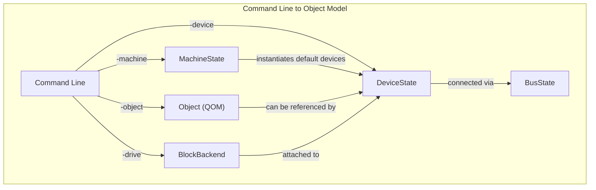

```mermaid

flowchart TD
 subgraph Command Line to Object Model["Command Line to Object Model"]
 CMD["Command Line"] --> |"-machine"| MACH["MachineState"]
 CMD --> |"-device"| DEV["DeviceState"]
 CMD --> |"-object"| OBJ["Object (QOM)"]
 CMD --> |"-drive"| BLK["BlockBackend"]

 MACH --> |"instantiates default devices"| DEV
 DEV --> |"connected via"| BUS["BusState"]
 OBJ --> |"can be referenced by"| DEV
 BLK --> |"attached to"| DEV
 end

```