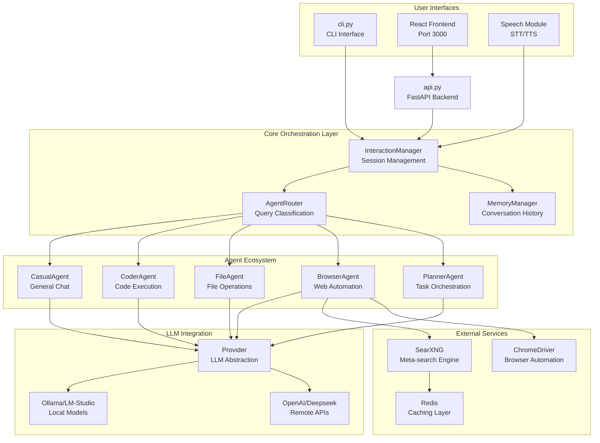

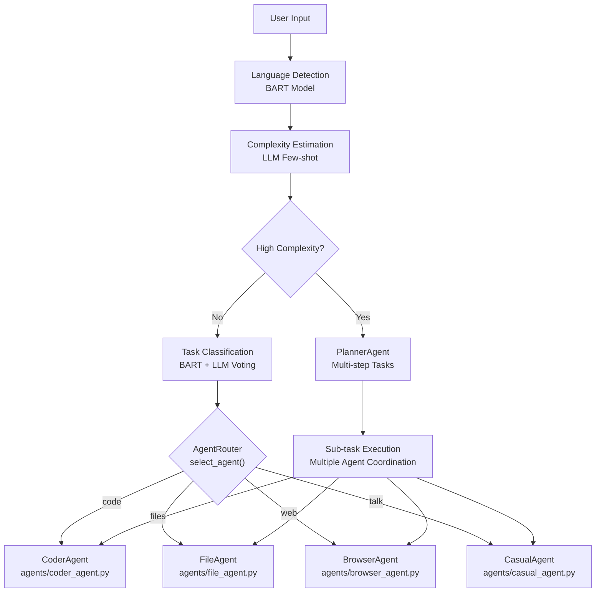

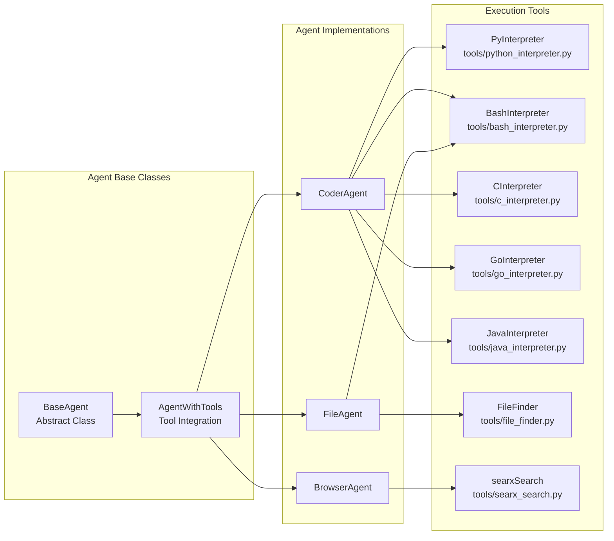

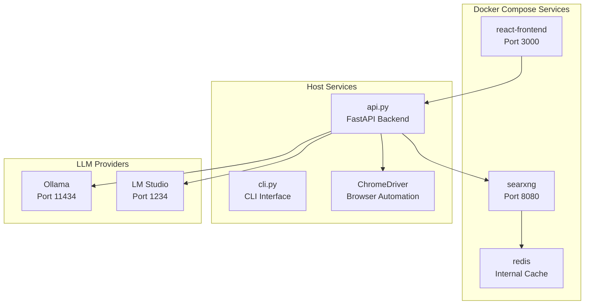

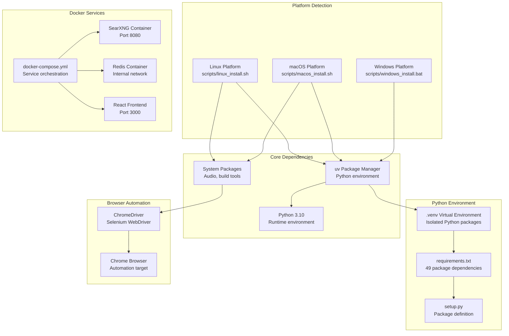

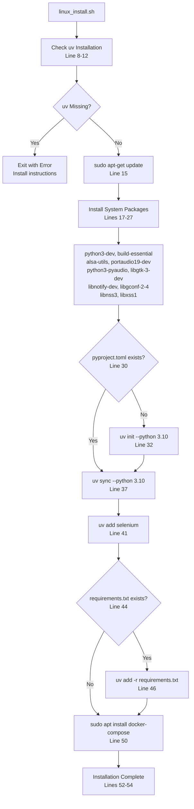

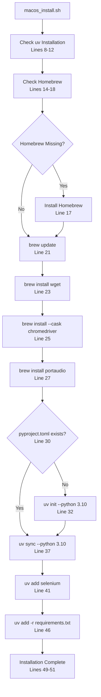

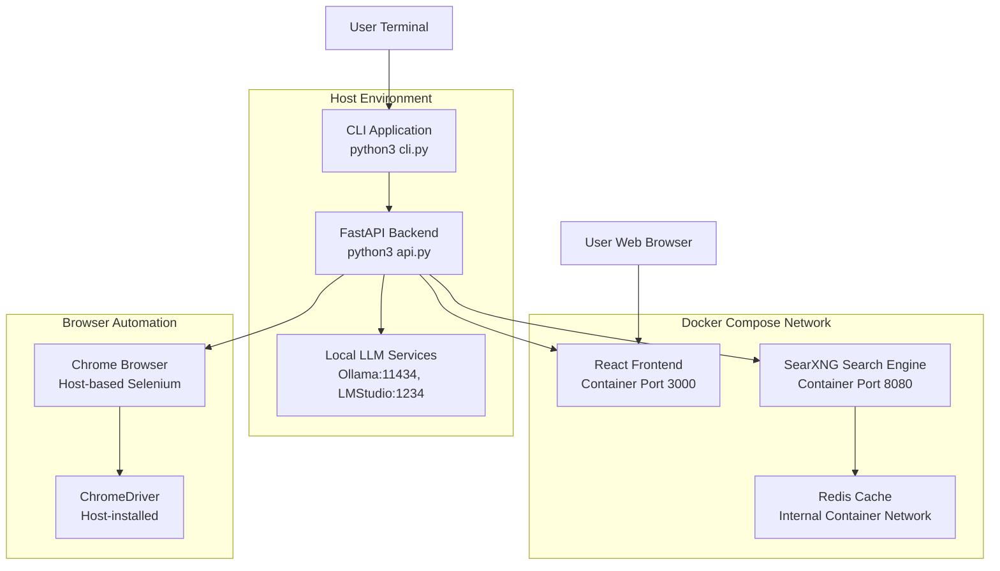

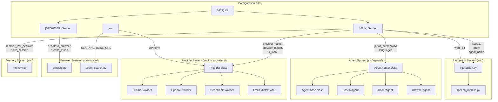

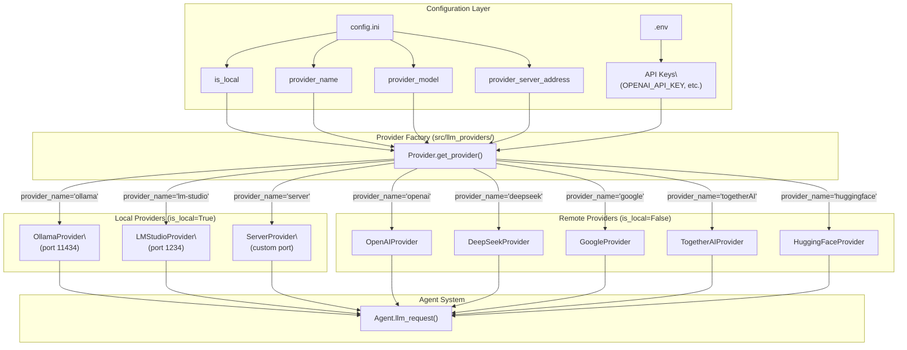

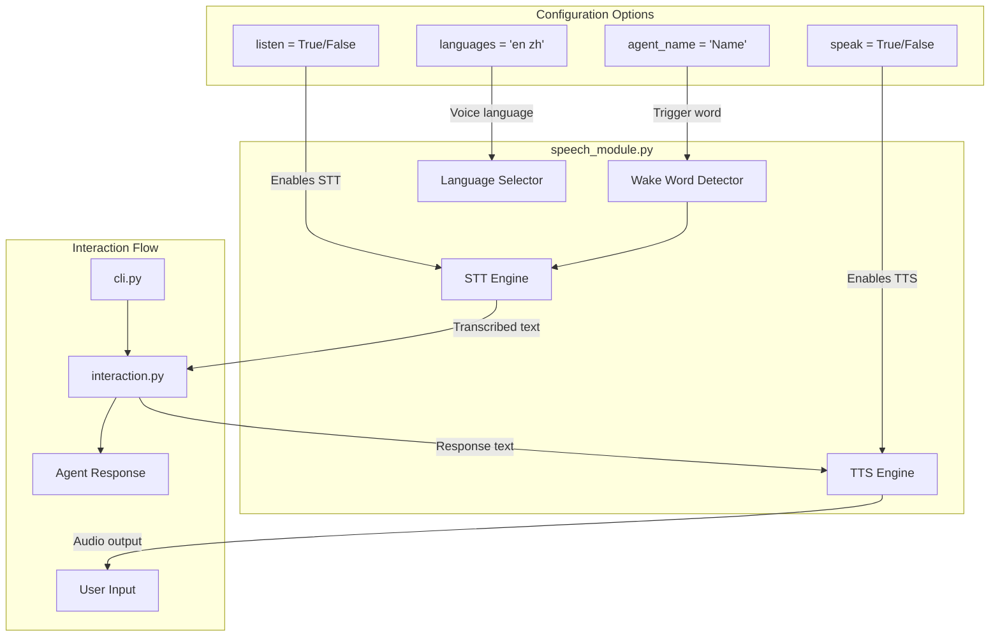

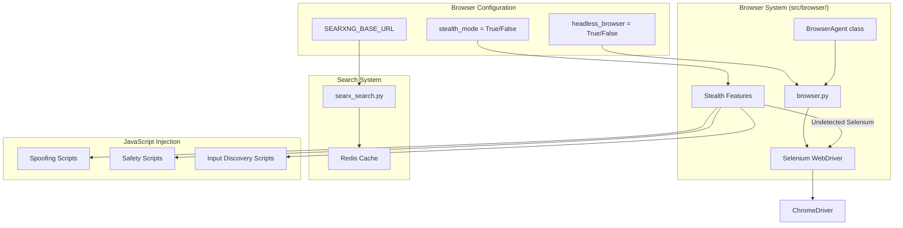

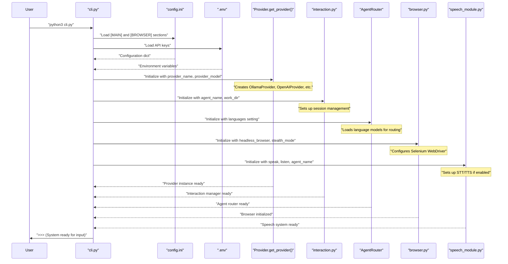

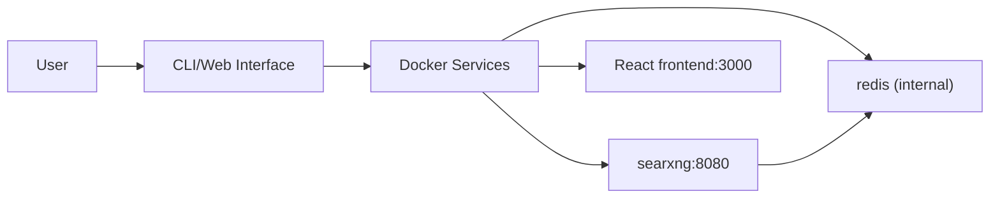

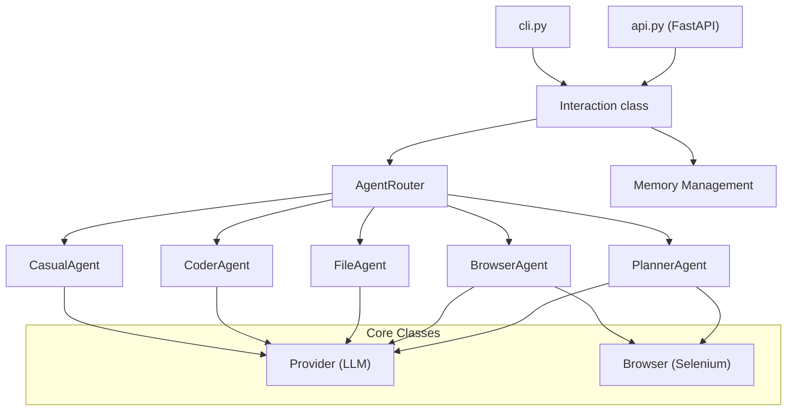

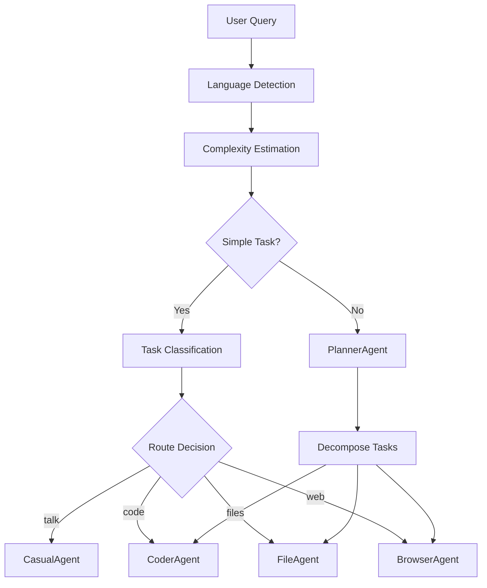

```mermaid
graph TB
    subgraph "Interaction Layer"
        Interaction["`Interaction`<br/>Session Management"]
        Speech["`Speech`<br/>TTS Engine"]
        AudioTranscriber["`AudioTranscriber`<br/>STT Engine"]
    end
    
    subgraph "Routing Layer"
        AgentRouter["`AgentRouter`<br/>LLM-based Classification"]
        LanguageUtility["`LanguageUtility`<br/>Language Detection"]
        AdaptiveClassifier["`AdaptiveClassifier`<br/>Few-shot Learning"]
    end
    
    subgraph "Agent Layer"
        CasualAgent["`CasualAgent`<br/>General Conversation"]
        CoderAgent["`CoderAgent`<br/>Code Execution"]
        FileAgent["`FileAgent`<br/>File Operations"]
        BrowserAgent["`BrowserAgent`<br/>Web Automation"]
        PlannerAgent["`PlannerAgent`<br/>Task Orchestration"]
    end
    
    subgraph "Memory System"
        Memory["`Memory`<br/>Conversation Storage"]
        Compression["`AutoModelForSeq2SeqLM`<br/>Memory Compression"]
    end
    
    Interaction --> AgentRouter
    AgentRouter --> LanguageUtility
    AgentRouter --> AdaptiveClassifier
    AgentRouter --> CasualAgent
    AgentRouter --> CoderAgent
    AgentRouter --> FileAgent
    AgentRouter --> BrowserAgent
    AgentRouter --> PlannerAgent
    
    CasualAgent --> Memory
    CoderAgent --> Memory
    FileAgent --> Memory
    BrowserAgent --> Memory
    PlannerAgent --> Memory
    
    Memory --> Compression
    
    Interaction --> Speech
    Interaction --> AudioTranscriber
```

```mermaid
flowchart TD
    UserQuery["`User Query`"] --> LanguageDetect["`detect_language()`<br/>LanguageUtility"]
    LanguageDetect --> ComplexityEst["`estimate_complexity()`<br/>Few-shot Classification"]
    
    ComplexityEst --> HighComplexity{"`complexity == 'HIGH'`"}
    HighComplexity -->|Yes| PlannerAgent["`find_planner_agent()`"]
    HighComplexity -->|No| RouterVote["`router_vote()`<br/>BART + LLM Voting"]
    
    RouterVote --> TaskClassification{"`Select Agent`"}
    TaskClassification -->|"talk"| CasualAgent["`CasualAgent`"]
    TaskClassification -->|"code"| CoderAgent["`CoderAgent`"]
    TaskClassification -->|"files"| FileAgent["`FileAgent`"]
    TaskClassification -->|"web"| BrowserAgent["`BrowserAgent`"]
    
    subgraph "Classification Models"
        BART["`facebook/bart-large-mnli`<br/>Zero-shot Pipeline"]
        LLMRouter["`AdaptiveClassifier`<br/>Few-shot Learning"]
    end
    
    RouterVote --> BART
    RouterVote --> LLMRouter
```

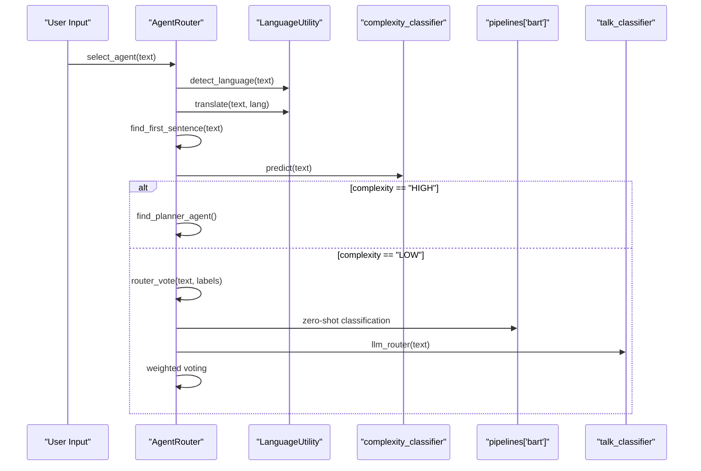

```mermaid
graph LR
    subgraph "Speech Input"
        AudioRecorder["`AudioRecorder`<br/>Microphone Capture"]
        AudioTranscriber["`AudioTranscriber`<br/>Whisper-based STT"]
    end
    
    subgraph "Speech Output"
        Speech["`Speech`<br/>Kokoro TTS"]
        VoiceMap["`voice_map`<br/>Multi-language Voices"]
        CleanSentence["`clean_sentence()`<br/>Text Preprocessing"]
    end
    
    subgraph "Audio Processing"
        KPipeline["`KPipeline`<br/>TTS Generation"]
        SoundOutput["`Platform Audio`<br/>aplay/afplay/winsound"]
    end
    
    AudioRecorder --> AudioTranscriber
    AudioTranscriber --> Interaction
    
    Interaction --> Speech
    Speech --> VoiceMap
    Speech --> CleanSentence
    CleanSentence --> KPipeline
    KPipeline --> SoundOutput
```

```mermaid
sequenceDiagram
    participant User as "User"
    participant CLI as "CLI/Web/Voice"
    participant Interaction as "Interaction"
    participant Router as "AgentRouter" 
    participant Agent as "Selected Agent"
    participant Memory as "Memory"
    participant Provider as "LLM Provider"
    
    User->>CLI: Input Query
    CLI->>Interaction: get_user()
    
    Interaction->>Router: select_agent(query)
    Router->>Router: Language detection \u0026 translation
    Router->>Router: Complexity estimation
    Router->>Router: Agent classification voting
    Router-->>Interaction: Selected Agent
    
    Interaction->>Agent: process(prompt, speech_module)
    Agent->>Memory: push('user', prompt)
    Agent->>Provider: LLM request with memory context
    Provider-->>Agent: LLM response
    
    Agent->>Agent: Parse reasoning \u0026 code blocks
    opt Code Execution Required
        Agent->>Agent: execute_modules(blocks)
    end
    
    Agent->>Memory: push('assistant', response)
    Agent-->>Interaction: Final answer
    
    Interaction->>Memory: save_session()
    Interaction->>CLI: Display response
    
    opt Voice Output Enabled
        Interaction->>Speech: speak(answer)
    end
```

```mermaid
graph TD
    User(("User"))
    
    subgraph "Interaction System"
        Interaction["Interaction\
sources/interaction.py"]
    end
    
    subgraph "Agent Router System"
        Router["AgentRouter\
sources/router.py"]
        TaskClassifier["Task Classification"]
        ComplexityEstimator["Complexity Estimation"]
        LanguageUtility["LanguageUtility"]
    end
    
    subgraph "Agent System"
        CasualAgent["CasualAgent\
(General Conversation)"]
        CoderAgent["CoderAgent\
(Programming Tasks)"]
        FileAgent["FileAgent\
(File Operations)"]
        BrowserAgent["BrowserAgent\
(Web Searches)"]
        PlannerAgent["PlannerAgent\
(Complex Tasks)"]
    end
    
    User --> Interaction
    Interaction --> |"think() calls\
select_agent()"| Router
    
    Router --> |"Contains"| TaskClassifier
    Router --> |"Contains"| ComplexityEstimator
    Router --> |"Uses"| LanguageUtility
    
    Router --> |"select_agent() returns\
appropriate agent"| CasualAgent
    Router --> |"select_agent() returns\
appropriate agent"| CoderAgent
    Router --> |"select_agent() returns\
appropriate agent"| FileAgent
    Router --> |"select_agent() returns\
appropriate agent"| BrowserAgent
    Router --> |"select_agent() returns\
appropriate agent"| PlannerAgent
```

```mermaid
sequenceDiagram
    participant User
    participant Interaction as "Interaction\
interaction.py"
    participant Router as "AgentRouter\
router.py"
    participant LangUtil as "LanguageUtility"
    participant TaskClassifier as "Task Classification"
    participant ComplexityEstimator as "Complexity Estimator"
    participant Agent as "Selected Agent"
    
    User->>+Interaction: input query
    Interaction->>+Router: select_agent(text)
    Router->>+LangUtil: detect_language(text)
    LangUtil-->>-Router: detected language
    
    Router->>+LangUtil: translate(text, lang)
    LangUtil-->>-Router: translated text
    
    Router->>+ComplexityEstimator: estimate_complexity(text)
    ComplexityEstimator-->>-Router: "HIGH" or "LOW"
    
    alt Complexity is "HIGH"
        Router->>Router: find_planner_agent()
    else Complexity is "LOW"
        Router->>+TaskClassifier: router_vote(text, labels)
        TaskClassifier-->>-Router: best agent role
    end
    
    Router-->>-Interaction: selected agent
    Interaction->>+Agent: process(query)
    Agent-->>-Interaction: response
    Interaction-->>User: display response
```

```mermaid
graph TD
    subgraph "AgentRouter Classification System"
        Input["User Query"]
        
        subgraph "Task Classification"
            AdaptiveClassifier["AdaptiveClassifier\
(Few-shot learning)"]
            BART["BART Zero-Shot\
Classification"]
            Vote["router_vote()\
Voting Mechanism"]
        end
        
        subgraph "Complexity Estimation"
            ComplexEstimator["estimate_complexity()\
Few-shot learning"]
        end
        
        Decide["Agent Selection Logic"]
        Output["Selected Agent"]
        
        Input --> AdaptiveClassifier
        Input --> BART
        AdaptiveClassifier --> |"Task prediction\
\u0026 confidence"| Vote
        BART --> |"Task prediction\
\u0026 confidence"| Vote
        Vote --> |"Best task category"| Decide
        
        Input --> ComplexEstimator
        ComplexEstimator --> |"HIGH/LOW complexity"| Decide
        
        Decide --> Output
    end
```

```mermaid
flowchart TD
    Start["User Query Input"] --> CheckAgents{"Multiple agents\
available?"}
    
    CheckAgents -- "No" --> UseOnly["Return only available agent"]
    CheckAgents -- "Yes" --> DetectLang["Detect language\
via LanguageUtility"]
    
    DetectLang --> ExtractSentence["Extract first sentence\
find_first_sentence()"]
    ExtractSentence --> Translate["Translate to English\
if needed"]
    
    Translate --> EstimateComplex["Estimate complexity\
estimate_complexity()"]
    
    EstimateComplex --> CheckComplex{"Is HIGH\
complexity?"}
    
    CheckComplex -- "Yes" --> FindPlanner["Find and return\
PlannerAgent"]
    
    CheckComplex -- "No" --> ClassifyTask["Classify task using\
router_vote()"]
    
    ClassifyTask --> FindAgent["Find agent matching\
classification"]
    
    FindAgent --> ReturnAgent["Return selected agent"]
    
    UseOnly --> End["End"]
    FindPlanner --> End
    ReturnAgent --> End
```

```mermaid
graph TB
    subgraph "Memory Core Components"
        Memory[Memory Class<br/>sources/memory.py]
        Logger[Logger<br/>memory.log]
        Device[Device Detection<br/>CUDA/MPS/CPU]
    end
    
    subgraph "Compression System"
        Tokenizer[AutoTokenizer<br/>pszemraj/led-base-book-summary]
        Model[AutoModelForSeq2SeqLM<br/>pszemraj/led-base-book-summary]
        ContextEst[get_ideal_ctx<br/>Context size estimation]
    end
    
    subgraph "Session Management"
        SaveMem[save_memory<br/>JSON persistence]
        LoadMem[load_memory<br/>Session recovery] 
        ConvFolder[conversations/<br/>File structure]
        SessionID[session_id<br/>UUID generation]
    end
    
    subgraph "Memory Operations"
        Push[push<br/>Add messages]
        Clear[clear<br/>Reset memory]
        Compress[compress<br/>Summarize content]
        Trim[trim_text_to_max_ctx<br/>Context truncation]
    end
    
    Memory --> Logger
    Memory --> Device
    Memory --> Tokenizer
    Memory --> Model
    Memory --> ContextEst
    
    Memory --> SaveMem
    Memory --> LoadMem
    Memory --> ConvFolder
    Memory --> SessionID
    
    Memory --> Push
    Memory --> Clear
    Memory --> Compress
    Memory --> Trim
    
    Push --> ContextEst
    ContextEst --> Compress
    Compress --> Model
    Compress --> Tokenizer
```

```mermaid
graph TB
    subgraph "Message Structure"
        Message[Message Dict]
        Role[role: str<br/>system/user/assistant]
        Content[content: str<br/>Message text]
        Time[time: str<br/>Timestamp]
        Model[model_used: str<br/>Provider name]
    end
    
    subgraph "Memory Array"
        SystemMsg[Index 0<br/>System Prompt]
        UserMsg1[Index 1<br/>User Message]
        AssistMsg1[Index 2<br/>Assistant Response]
        UserMsg2[Index 3<br/>User Message]
        AssistMsg2[Index 4<br/>Assistant Response]
        MoreMsgs[... more messages]
    end
    
    subgraph "Memory Operations"
        PushOp[push(role, content)<br/>Add new message]
        ClearOp[clear()<br/>Keep only system]
        ClearSectionOp[clear_section(start, end)<br/>Remove range]
        GetOp[get()<br/>Return full memory]
    end
    
    Message --> Role
    Message --> Content
    Message --> Time
    Message --> Model
    
    SystemMsg --> UserMsg1
    UserMsg1 --> AssistMsg1
    AssistMsg1 --> UserMsg2
    UserMsg2 --> AssistMsg2
    AssistMsg2 --> MoreMsgs
    
    PushOp --> Message
    ClearOp --> SystemMsg
    ClearSectionOp --> Message
    GetOp --> Message
```

```mermaid
graph TB
    subgraph "Context Management"
        IdealCtx[get_ideal_ctx<br/>Estimate model context]
        ModelSize[extract_number_before_b<br/>Parse model size]
        ContextCalc[Context calculation<br/>base_size * scaling_factor]
    end
    
    subgraph "Compression Pipeline" 
        CheckSize[Content length check]
        SummarizeFunc[summarize<br/>Transform text]
        TokenizeInput[tokenizer encode<br/>max_length=512]
        GenerateSum[model.generate<br/>beam search]
        DecodeOutput[tokenizer.decode<br/>skip_special_tokens]
    end
    
    subgraph "Compression Triggers"
        PushTrigger[push() method<br/>Auto-compress check]
        ManualTrigger[compress() method<br/>Manual compression]
        CtxTrigger[compress_text_to_max_ctx<br/>Context-aware compression]
    end
    
    IdealCtx --> ModelSize
    ModelSize --> ContextCalc
    ContextCalc --> CheckSize
    
    CheckSize --> SummarizeFunc
    SummarizeFunc --> TokenizeInput
    TokenizeInput --> GenerateSum
    GenerateSum --> DecodeOutput
    
    PushTrigger --> IdealCtx
    ManualTrigger --> SummarizeFunc
    CtxTrigger --> SummarizeFunc
```

```mermaid
graph TB
    subgraph "File Organization"
        ConvFolder[conversations/ directory]
        AgentFolder[agent_type subdirectory<br/>casual_agent/coder_agent/etc]
        MemoryFile[memory_YYYY-MM-DD_HH-MM-SS.txt<br/>JSON format]
    end
    
    subgraph "Save Operations"
        SaveMemory[save_memory(agent_type)<br/>Persist session]
        GetFilename[get_filename()<br/>Generate timestamp name]
        SaveJsonFile[save_json_file<br/>Write JSON data]
        CreateDirs[Create directories<br/>if not exist]
    end
    
    subgraph "Load Operations"
        LoadMemory[load_memory(agent_type)<br/>Restore session]
        FindLastSession[find_last_session_path<br/>Get most recent]
        LoadJsonFile[load_json_file<br/>Parse JSON data]
        SessionRecovered[session_recovered flag<br/>Track state]
    end
    
    subgraph "Session Metadata"
        SessionID[session_id<br/>UUID4 identifier]
        SessionTime[session_time<br/>datetime.now()]
        Filename[Generated filename<br/>Timestamp-based]
    end
    
    ConvFolder --> AgentFolder
    AgentFolder --> MemoryFile
    
    SaveMemory --> GetFilename
    SaveMemory --> CreateDirs
    SaveMemory --> SaveJsonFile
    GetFilename --> Filename
    
    LoadMemory --> FindLastSession
    LoadMemory --> LoadJsonFile
    LoadMemory --> SessionRecovered
    FindLastSession --> MemoryFile
    
    SessionID --> Filename
    SessionTime --> Filename
```

```mermaid
graph TB
    subgraph "Initialization Parameters"
        SystemPrompt[system_prompt: str<br/>Base agent instructions]
        RecoverSession[recover_last_session: bool<br/>Auto-load previous session]
        MemCompression[memory_compression: bool<br/>Enable summarization]
        ModelProvider[model_provider: str<br/>LLM identifier]
    end
    
    subgraph "Runtime Configuration"
        DeviceDetection[get_cuda_device()<br/>Auto-detect hardware]
        ModelDownload[download_model()<br/>Load compression model]
        FolderCreation[Create conversations/<br/>Setup directory structure]
        LoggerInit[Logger initialization<br/>memory.log]
    end
    
    subgraph "Session State"
        MemoryList[self.memory list<br/>Message storage]
        SessionMeta[Session metadata<br/>ID, timestamp, recovered flag]
        CompressionState[Model/tokenizer state<br/>Loaded if enabled]
    end
    
    SystemPrompt --> MemoryList
    RecoverSession --> SessionMeta
    MemCompression --> CompressionState
    ModelProvider --> CompressionState
    
    DeviceDetection --> CompressionState
    ModelDownload --> CompressionState
    FolderCreation --> SessionMeta
    LoggerInit --> SessionMeta
    
    MemoryList --> SessionMeta
    SessionMeta --> CompressionState
```

```mermaid
graph TB
    subgraph "Core Operations"
        PushAPI[push(role, content)<br/>Add message with metadata]
        GetAPI[get()<br/>Return complete memory]
        ClearAPI[clear()<br/>Reset to system prompt]
        ResetAPI[reset(memory)<br/>Replace entire memory]
    end
    
    subgraph "Advanced Operations"
        ClearSectionAPI[clear_section(start, end)<br/>Remove message range]
        CompressAPI[compress()<br/>Summarize all messages]
        CompressTextAPI[compress_text_to_max_ctx(text)<br/>Fit to context limit]
        TrimTextAPI[trim_text_to_max_ctx(text)<br/>Truncate to limit]
    end
    
    subgraph "Persistence Operations"
        SaveAPI[save_memory(agent_type)<br/>Persist to file]
        LoadAPI[load_memory(agent_type)<br/>Restore from file]
        FilenameAPI[get_filename()<br/>Generate timestamp name]
        FindSessionAPI[find_last_session_path(path)<br/>Locate recent session]
    end
    
    PushAPI --> CompressAPI
    ClearAPI --> GetAPI
    ResetAPI --> GetAPI
    ClearSectionAPI --> GetAPI
    
    CompressAPI --> CompressTextAPI
    CompressTextAPI --> TrimTextAPI
    
    SaveAPI --> FilenameAPI
    LoadAPI --> FindSessionAPI
    LoadAPI --> CompressAPI
```

```mermaid
graph TB
    subgraph "Provider Interface Layer"
        Provider["Provider Class<br/>sources/llm_provider.py"]
        respond["respond(history, verbose)"]
        get_api_key["get_api_key(provider)"]
        is_ip_online["is_ip_online(address)"]
    end
    
    subgraph "Provider Registry"
        available_providers["available_providers dict"]
        unsafe_providers["unsafe_providers list"]
    end
    
    subgraph "Local Providers"
        ollama_fn["ollama_fn()"]
        lm_studio_fn["lm_studio_fn()"]
        server_fn["server_fn()"]
    end
    
    subgraph "Cloud Providers"
        openai_fn["openai_fn()"]
        google_fn["google_fn()"]
        deepseek_fn["deepseek_fn()"]
        together_fn["together_fn()"]
        openrouter_fn["openrouter_fn()"]
        huggingface_fn["huggingface_fn()"]
        dsk_deepseek["dsk_deepseek()"]
    end
    
    subgraph "External Services"
        OllamaClient["OllamaClient<br/>host:11434"]
        OpenAI_API["OpenAI API<br/>api.openai.com"]
        LMStudio["LM Studio Server<br/>localhost:1234"]
        CustomServer["Custom Server<br/>user-defined"]
    end
    
    Provider --> available_providers
    Provider --> unsafe_providers
    respond --> available_providers
    
    available_providers --> ollama_fn
    available_providers --> lm_studio_fn
    available_providers --> server_fn
    available_providers --> openai_fn
    available_providers --> google_fn
    available_providers --> deepseek_fn
    available_providers --> together_fn
    available_providers --> openrouter_fn
    available_providers --> huggingface_fn
    available_providers --> dsk_deepseek
    
    ollama_fn --> OllamaClient
    openai_fn --> OpenAI_API
    lm_studio_fn --> LMStudio
    server_fn --> CustomServer
```

```mermaid
flowchart TD
    init["Provider.__init__()"] --> validate["Validate provider_name<br/>in available_providers"]
    validate --> check_unsafe["Check if provider in<br/>unsafe_providers list"]
    
    check_unsafe -->|"Cloud Provider"| warn_cloud["pretty_print warning<br/>about cloud data"]
    check_unsafe -->|"Local Provider"| confirm_local["pretty_print success<br/>message with server_ip"]
    
    warn_cloud --> get_key["get_api_key()<br/>from .env file"]
    get_key --> setup_complete["Provider ready"]
    confirm_local --> setup_complete
    
    validate -->|"Invalid"| raise_error["raise ValueError<br/>Unknown provider"]
```

```mermaid
sequenceDiagram
    participant Agent as "Agent"
    participant Provider as "Provider.respond()"
    participant Logger as "provider.log"
    participant ProviderFn as "Selected Provider Function"
    participant External as "External Service"
    
    Agent->>Provider: "respond(history, verbose)"
    Provider->>Logger: "info: Using provider at server_ip"
    Provider->>ProviderFn: "available_providers[provider_name]"
    
    alt KeyboardInterrupt
        ProviderFn-->>Provider: "Ctrl+C caught"
        Provider-->>Agent: "Operation interrupted by user. REQUEST_EXIT"
    else ConnectionError
        ProviderFn-->>Provider: "Connection failed"
        Provider-->>Agent: "raise ConnectionError with server_ip"
    else Success
        ProviderFn->>External: "API call / server request"
        External-->>ProviderFn: "Response"
        ProviderFn-->>Provider: "Generated text"
        Provider-->>Agent: "thought"
    end
```

```mermaid
graph LR
    ollama_fn["ollama_fn()"] --> host_check["Determine host<br/>localhost:11434 vs server_address"]
    host_check --> client["OllamaClient(host)"]
    client --> stream["client.chat(stream=True)"]
    stream --> chunk_loop["Process chunks<br/>accumulate thought"]
    
    stream -->|"404 Error"| download["client.pull(model)<br/>animate_thinking()"]
    download --> retry["Recursive call<br/>ollama_fn()"]
```

```mermaid
graph TB
    openai_fn["openai_fn()"] --> local_check["Check is_local flag"]
    local_check -->|"True"| local_client["OpenAI(base_url=http://server_ip)"]
    local_check -->|"False"| cloud_client["OpenAI(api_key=api_key)"]
    
    local_client --> create_completion["client.chat.completions.create()"]
    cloud_client --> create_completion
    create_completion --> extract["response.choices[0].message.content"]
```

```mermaid
flowchart TD
    is_ip_online["is_ip_online(address, timeout)"] --> parse_url["urlparse() hostname extraction"]
    parse_url --> localhost_check["localhost/127.0.0.1 check"]
    localhost_check -->|"Local"| return_true["return True"]
    localhost_check -->|"Remote"| resolve_dns["socket.gethostbyname()"]
    
    resolve_dns -->|"Success"| ping_cmd["Platform-specific ping<br/>Windows: -n, Unix: -c"]
    resolve_dns -->|"DNS Error"| return_false["return False"]
    ping_cmd --> check_result["result.returncode == 0"]
    check_result --> return_result["return boolean"]
```

```mermaid
graph LR
    get_api_key["get_api_key(provider)"] --> load_env["load_dotenv()"]
    load_env --> construct_var["api_key_var = f'{provider.upper()}_API_KEY'"]
    construct_var --> get_env["os.getenv(api_key_var)"]
    get_env -->|"Found"| return_key["return api_key"]
    get_env -->|"Not Found"| warning["pretty_print warning<br/>exit(1)"]
```

```mermaid
graph TB
    subgraph "User Input Layer"
        UserQuery["User Query"]
        AgentRouter["AgentRouter"]
    end
    
    subgraph "Agent System"
        Agent["Agent (Base Class)"]
        CasualAgent["CasualAgent"]
        CoderAgent["CoderAgent"] 
        FileAgent["FileAgent"]
        BrowserAgent["BrowserAgent"]
        PlannerAgent["PlannerAgent"]
        McpAgent["McpAgent"]
    end
    
    subgraph "Execution Layer"
        Memory["Memory"]
        Provider["LLM Provider"]
        Tools["Tool System"]
        Browser["Browser Automation"]
    end
    
    UserQuery --> AgentRouter
    AgentRouter --> CasualAgent
    AgentRouter --> CoderAgent
    AgentRouter --> FileAgent
    AgentRouter --> BrowserAgent
    AgentRouter --> PlannerAgent
    AgentRouter --> McpAgent
    
    CasualAgent --> Agent
    CoderAgent --> Agent
    FileAgent --> Agent
    BrowserAgent --> Agent
    PlannerAgent --> Agent
    McpAgent --> Agent
    
    Agent --> Memory
    Agent --> Provider
    Agent --> Tools
    BrowserAgent --> Browser
```

```mermaid
classDiagram
    class Agent {
        +agent_name: str
        +memory: Memory
        +llm: Provider
        +tools: dict
        +blocks_result: list
        +status_message: str
        +success: bool
        +last_answer: str
        +last_reasoning: str
        
        +process(prompt, speech_module)* str
        +llm_request() Tuple[str, str]
        +execute_modules(answer) Tuple[bool, str]
        +add_tool(name, tool) None
        +load_prompt(file_path) str
        +extract_reasoning_text(text) str
        +remove_reasoning_text(text) str
        +show_answer() None
    }
    
    class CasualAgent {
        +process(prompt, speech_module) str
    }
    
    class CoderAgent {
        +process(prompt, speech_module) str
    }
    
    class FileAgent {
        +process(prompt, speech_module) str
    }
    
    class BrowserAgent {
        +browser: Browser
        +process(prompt, speech_module) str
    }
    
    class PlannerAgent {
        +process(prompt, speech_module) str
    }
    
    class McpAgent {
        +process(prompt, speech_module) str
    }
    
    Agent <|-- CasualAgent
    Agent <|-- CoderAgent
    Agent <|-- FileAgent
    Agent <|-- BrowserAgent
    Agent <|-- PlannerAgent
    Agent <|-- McpAgent
```

```mermaid
flowchart TD
    UserInput["User Input"] --> ComplexityCheck{"High Complexity?"}
    ComplexityCheck -->|Yes| PlannerAgent["PlannerAgent"]
    ComplexityCheck -->|No| TaskClassifier["Task Classification"]
    
    TaskClassifier --> TalkRoute{"talk"}
    TaskClassifier --> CodeRoute{"code"}
    TaskClassifier --> FileRoute{"files"}
    TaskClassifier --> WebRoute{"web"}
    TaskClassifier --> McpRoute{"mcp"}
    
    TalkRoute --> CasualAgent["CasualAgent"]
    CodeRoute --> CoderAgent["CoderAgent"]
    FileRoute --> FileAgent["FileAgent"]
    WebRoute --> BrowserAgent["BrowserAgent"]
    McpRoute --> McpAgent["McpAgent"]
    
    PlannerAgent --> SubTasks["Decompose Tasks"]
    SubTasks --> CasualAgent
    SubTasks --> CoderAgent
    SubTasks --> FileAgent
    SubTasks --> BrowserAgent
```

```mermaid
sequenceDiagram
    participant User
    participant Agent
    participant Memory
    participant Provider as "LLM Provider"
    participant Tools
    
    User->>Agent: "process(prompt, speech_module)"
    Agent->>Memory: "push('user', prompt)"
    Agent->>Agent: "llm_request()"
    Agent->>Provider: "respond(memory.get())"
    Provider-->>Agent: "LLM response"
    Agent->>Agent: "extract_reasoning_text()"
    Agent->>Agent: "remove_reasoning_text()"
    Agent->>Memory: "push('assistant', answer)"
    Agent->>Agent: "execute_modules(answer)"
    Agent->>Tools: "load_exec_block(answer)"
    Tools-->>Agent: "code blocks"
    Agent->>Tools: "execute(blocks)"
    Tools-->>Agent: "execution results"
    Agent->>Memory: "push('user', feedback)"
    Agent-->>User: "final answer"
```

```mermaid
classDiagram
    class Agent {
        +agent_name: str
        +role: str
        +type: str
        +llm: provider
        +memory: Memory
        +tools: dict
        +browser: object
        +blocks_result: list
        +success: bool
        +last_answer: str
        +last_reasoning: str
        +status_message: str
        +stop: bool
        +executor: ThreadPoolExecutor
        
        +get_agent_name() str
        +get_agent_type() str
        +get_agent_role() str
        +add_tool(name, tool) None
        +get_tools_name() list
        +get_tools_description() str
        +load_prompt(file_path) str
        +request_stop() None
        +process(prompt, speech_module)* str
        +llm_request() Tuple[str, str]
        +execute_modules(answer) Tuple[bool, str]
        +show_answer() None
        +remove_blocks(text) str
    }
    
    class CasualAgent {
        +process(prompt, speech_module) str
    }
    
    class CoderAgent {
        +process(prompt, speech_module) str
    }
    
    class FileAgent {
        +process(prompt, speech_module) str
    }
    
    class BrowserAgent {
        +process(prompt, speech_module) str
    }
    
    class PlannerAgent {
        +process(prompt, speech_module) str
    }
    
    Agent <|-- CasualAgent
    Agent <|-- CoderAgent
    Agent <|-- FileAgent
    Agent <|-- BrowserAgent
    Agent <|-- PlannerAgent
```

```mermaid
flowchart TD
    Agent["Agent Instance"] --> tools["tools: dict"]
    tools --> add_tool["add_tool(name, tool)"]
    tools --> get_tools_name["get_tools_name()"]
    tools --> get_tools_description["get_tools_description()"]
    
    add_tool --> validate["Validate Callable"]
    validate --> register["Register in tools dict"]
    
    get_tools_name --> list_names["Return tool names list"]
    get_tools_description --> build_desc["Build description string"]
    build_desc --> tool_desc["tool.description for each"]
```

```mermaid
sequenceDiagram
    participant Agent
    participant Tool as "Tool Instance"
    participant Block as "Code Block"
    participant Result as "executorResult"
    
    Agent->>Agent: "execute_modules(answer)"
    Agent->>Tool: "load_exec_block(answer)"
    Tool-->>Agent: "blocks, save_path"
    
    loop "For each block"
        Agent->>Agent: "show_block(block)"
        Agent->>Tool: "execute([block])"
        Tool-->>Agent: "output"
        Agent->>Tool: "interpreter_feedback(output)"
        Tool-->>Agent: "feedback"
        Agent->>Tool: "execution_failure_check(output)"
        Tool-->>Agent: "success"
        Agent->>Result: "executorResult(block, feedback, success, name)"
        Agent->>Agent: "blocks_result.append(result)"
        
        alt "Execution failed"
            Agent->>Agent: "self.success = False"
            Agent->>Memory: "push('user', feedback)"
            Agent-->>Agent: "return False, feedback"
        end
    end
    
    Agent->>Memory: "push('user', feedback)"
    
    opt "Save blocks if needed"
        Agent->>Tool: "save_block(blocks, save_path)"
    end
```

```mermaid
flowchart TD
    llm_request["llm_request()"] --> status1["status_message = 'Thinking...'"]
    status1 --> executor["loop.run_in_executor(sync_llm_request)"]
    
    executor --> sync_llm_request["sync_llm_request()"]
    sync_llm_request --> get_memory["memory.get()"]
    get_memory --> llm_respond["llm.respond(memory, verbose)"]
    llm_respond --> thought["thought: str"]
    
    thought --> extract_reasoning["extract_reasoning_text(thought)"]
    thought --> remove_reasoning["remove_reasoning_text(thought)"]
    
    extract_reasoning --> reasoning["reasoning: str"]
    remove_reasoning --> answer["answer: str"]
    
    answer --> push_memory["memory.push('assistant', answer)"]
    push_memory --> return_result["return (answer, reasoning)"]
```

```mermaid
flowchart TD
    llm_response["LLM Response with Code Blocks"] --> remove_blocks["remove_blocks(text)"]
    remove_blocks --> processed_text["Text with block: references"]
    
    processed_text --> execute_modules["execute_modules(answer)"]
    execute_modules --> tool_execution["Tool execution loop"]
    tool_execution --> blocks_result["blocks_result: List[executorResult]"]
    
    blocks_result --> show_answer["show_answer()"]
    show_answer --> parse_lines["Parse response lines"]
    parse_lines --> check_block["Check for 'block:' references"]
    
    check_block --> display_text["Display text line"]
    check_block --> display_block["Display executed block result"]
    display_block --> block_show["blocks_result[idx].show()"]
```

```mermaid
classDiagram
    class Agent {
        <<abstract>>
        +name: str
        +prompt_path: str
        +provider: Provider
        +memory: Memory
        +process(prompt, speech_module)*
        +llm_request()
        +load_prompt()
    }
    
    class CasualAgent {
        +role: "talk"
        +type: "casual_agent"
        +tools: dict (empty)
        +process(prompt, speech_module)
    }
    
    class CoderAgent {
        +role: "code"
        +tools: dict (6 tools)
        +execute_modules()
    }
    
    class FileAgent {
        +role: "files"
        +tools: dict (2 tools)
        +execute_modules()
    }
    
    Agent <|-- CasualAgent
    Agent <|-- CoderAgent
    Agent <|-- FileAgent
    
    note for CasualAgent "No tools - pure conversation"
    note for CoderAgent "Multiple interpreters + file operations"
    note for FileAgent "File operations + bash"
```

```mermaid
sequenceDiagram
    participant User
    participant AgentRouter
    participant CasualAgent
    participant Memory
    participant Provider as "LLM Provider"
    
    User->>AgentRouter: "How are you today?"
    AgentRouter->>AgentRouter: classify_query() → "talk"
    AgentRouter->>CasualAgent: select CasualAgent
    
    CasualAgent->>Memory: push('user', prompt)
    CasualAgent->>CasualAgent: animate_thinking("Thinking...")
    CasualAgent->>Provider: llm_request()
    Provider-->>CasualAgent: response + reasoning
    CasualAgent->>CasualAgent: set last_answer, status_message
    CasualAgent-->>User: conversational response
    
    note over CasualAgent: No tool execution
    note over CasualAgent: No code block parsing
    note over CasualAgent: No iterative correction
```

```mermaid
flowchart TD
    UserQuery["User Query"] --> LanguageDetect["Language Detection"]
    LanguageDetect --> ComplexityEst["Complexity Estimation"]
    ComplexityEst --> TaskClass["Task Classification"]
    
    TaskClass --> RouteDecision{"Route Decision"}
    RouteDecision -->|"talk"| CasualAgent["CasualAgent.process()"]
    RouteDecision -->|"code"| CoderAgent["CoderAgent.process()"]
    RouteDecision -->|"files"| FileAgent["FileAgent.process()"]
    RouteDecision -->|"web"| BrowserAgent["BrowserAgent.process()"]
    
    CasualAgent --> MemoryPush["memory.push('user', prompt)"]
    MemoryPush --> LLMRequest["llm_request()"]
    LLMRequest --> Response["Return conversational response"]
    
    note for CasualAgent "role = 'talk'"
    note for CoderAgent "role = 'code'"
    note for FileAgent "role = 'files'"
```

```mermaid
graph TD
    subgraph "CasualAgent Flow"
        CasualStart["User Input"] --> CasualMemory["Push to Memory"]
        CasualMemory --> CasualLLM["LLM Request"]
        CasualLLM --> CasualEnd["Return Response"]
    end
    
    subgraph "CoderAgent Flow"
        CoderStart["User Input"] --> CoderMemory["Push to Memory"]
        CoderMemory --> CoderLoop{"Execution Loop"}
        CoderLoop --> CoderLLM["LLM Request"]
        CoderLLM --> CoderParse["Parse Code Blocks"]
        CoderParse --> CoderExec["Execute Tools"]
        CoderExec --> CoderCheck{"Success?"}
        CoderCheck -->|No| CoderCorrect["Correction Feedback"]
        CoderCorrect --> CoderLoop
        CoderCheck -->|Yes| CoderEnd["Return Response"]
    end
    
    subgraph "FileAgent Flow"
        FileStart["User Input"] --> FileMemory["Push to Memory"]
        FileMemory --> FileLoop{"Execution Loop"}
        FileLoop --> FileLLM["LLM Request"]
        FileLLM --> FileExec["Execute File Tools"]
        FileExec --> FileCheck{"Success?"}
        FileCheck -->|No| FileLoop
        FileCheck -->|Yes| FileEnd["Return Response"]
    end
```

```mermaid
graph TD
    BaseAgent["Agent Base Class"]
    CoderAgent["CoderAgent"]
    CasualAgent["CasualAgent"]
    FileAgent["FileAgent"]
    BrowserAgent["BrowserAgent"]
    PlannerAgent["PlannerAgent"]
    
    Tools["Tools Registry"]
    BashInt["BashInterpreter"]
    PyInt["PyInterpreter"]
    CInt["CInterpreter"]
    GoInt["GoInterpreter"]
    JavaInt["JavaInterpreter"]
    FileFinder["FileFinder"]
    
    Router["Agent Router"] --> BaseAgent
    BaseAgent --> CoderAgent
    BaseAgent --> CasualAgent
    BaseAgent --> FileAgent
    BaseAgent --> BrowserAgent
    BaseAgent --> PlannerAgent
    
    CoderAgent --> BashInt
    CoderAgent --> PyInt
    CoderAgent --> CInt
    CoderAgent --> GoInt
    CoderAgent --> JavaInt
    CoderAgent --> FileFinder
    
    Tools --> BashInt
    Tools --> PyInt
    Tools --> CInt
    Tools --> GoInt
    Tools --> JavaInt
    Tools --> FileFinder
```

```mermaid
classDiagram
    Agent <|-- CoderAgent
    
    class Agent {
        +name: str
        +prompt_path: str
        +provider: LLMProvider
        +verbose: bool
        +memory: Memory
        +llm_request()
        +execute_modules()
        +remove_blocks()
    }
    
    class CoderAgent {
        +tools: dict
        +work_dir: str
        +role: "code"
        +type: "code_agent"
        +add_sys_info_prompt(prompt)
        +process(prompt, speech_module)
    }
```

```mermaid
sequenceDiagram
    participant User
    participant CoderAgent
    participant LLMProvider
    participant Tools
    
    User->>CoderAgent: Send prompt
    CoderAgent->>CoderAgent: Add system info (add_sys_info_prompt)
    CoderAgent->>CoderAgent: Store in memory
    
    loop Until success or max attempts (5)
        CoderAgent->>LLMProvider: Request LLM completion
        LLMProvider->>CoderAgent: Return response
        
        alt Response contains "REQUEST_CLARIFICATION"
            CoderAgent->>User: Request clarification
        else Response contains code blocks
            CoderAgent->>Tools: Execute code (execute_modules)
            Tools->>CoderAgent: Return execution result
            
            alt Execution success and not bash
                CoderAgent->>User: Return formatted answer
            else Execution failure or bash command
                CoderAgent->>CoderAgent: Increment attempt counter
                Note over CoderAgent: Retry with error feedback
            end
        else No code blocks
            CoderAgent->>User: Return answer directly
        end
    end
```

```mermaid
classDiagram
    class Agent {
        <<abstract>>
        +name: str
        +prompt_path: str
        +provider: Provider
        +process(prompt, speech_module)
        +execute_modules(answer)
        +llm_request()
    }
    
    class FileAgent {
        +role: "files"
        +type: "file_agent"
        +work_dir: str
        +tools: dict
        +memory: Memory
        +process(prompt, speech_module)
    }
    
    class FileFinder {
        +get_work_dir()
        +find_files()
        +search_operations()
    }
    
    class BashInterpreter {
        +execute_command()
        +file_operations()
        +directory_operations()
    }
    
    class Memory {
        +push(role, content)
        +conversation_history()
        +memory_compression: False
    }
    
    Agent <|-- FileAgent
    FileAgent --> FileFinder : "file_finder"
    FileAgent --> BashInterpreter : "bash"
    FileAgent --> Memory : manages
```

```mermaid
graph TB
    UserQuery["User Query"] --> AgentRouter["AgentRouter"]
    AgentRouter --> TaskClassification["Task Classification"]
    TaskClassification -->|"files"| FileAgent["FileAgent"]
    
    FileAgent --> FileFinder["FileFinder"]
    FileAgent --> BashInterpreter["BashInterpreter"]
    FileAgent --> Provider["LLM Provider"]
    FileAgent --> Memory["Memory System"]
    
    FileFinder --> WorkDir["work_dir"]
    BashInterpreter --> FileSystem["File System Operations"]
    
    Provider --> LLMResponse["LLM Response"]
    LLMResponse --> CodeBlocks["Code Block Extraction"]
    CodeBlocks --> ToolExecution["Tool Execution"]
    ToolExecution --> ExecutionResult["exec_success"]
    
    ExecutionResult -->|False| FileAgent
    ExecutionResult -->|True| FinalAnswer["Final Answer"]
```

```mermaid
sequenceDiagram
    participant User
    participant FileAgent
    participant Memory
    participant Provider as "LLM Provider"
    participant Tools
    participant FileSystem as "File System"
    
    User->>FileAgent: "File operation request"
    FileAgent->>FileAgent: "Add work_dir to prompt"
    FileAgent->>Memory: "push('user', prompt)"
    
    loop Until exec_success = True
        FileAgent->>FileAgent: "wait_message(speech_module)"
        FileAgent->>FileAgent: "animate_thinking('Thinking...')"
        FileAgent->>Provider: "llm_request()"
        Provider-->>FileAgent: "answer, reasoning"
        FileAgent->>Tools: "execute_modules(answer)"
        Tools->>FileSystem: "File operations"
        FileSystem-->>Tools: "Operation results"
        Tools-->>FileAgent: "exec_success, feedback"
        FileAgent->>FileAgent: "remove_blocks(answer)"
        
        alt exec_success = False
            Note over FileAgent: Continue loop for retry
        else exec_success = True
            FileAgent->>FileAgent: "status_message = 'Ready'"
            FileAgent-->>User: "answer, reasoning"
        end
    end
```

```mermaid
graph TB
    User["User Query"] --> BA["BrowserAgent"]
    BA --> SearchPrompt["search_prompt()"]
    SearchPrompt --> LLM["LLM Request"]
    LLM --> SearchTool["searxSearch Tool"]
    SearchTool --> Results["Search Results"]
    Results --> NavigationLoop["Navigation Loop"]
    
    subgraph "Navigation Loop"
        NavPrompt["make_navigation_prompt()"]
        Browser["Browser.go_to()"]
        PageText["Browser.get_text()"]
        FormCheck["extract_form()"]
        LinkExtract["extract_links()"]
        Decision["AI Decision"]
        
        NavPrompt --> Decision
        Decision --> Browser
        Browser --> PageText
        PageText --> FormCheck
        PageText --> LinkExtract
        FormCheck --> FormFill["Browser.fill_form()"]
        LinkExtract --> Browser
    end
    
    NavigationLoop --> Conclusion["conclude_prompt()"]
    Conclusion --> FinalAnswer["Final Answer"]
```

```mermaid
classDiagram
    class BrowserAgent {
        +searxSearch tools
        +Browser browser
        +List~str~ search_history
        +List~str~ navigable_links
        +List~str~ notes
        +Action last_action
        +Memory memory
        
        +search_prompt(user_prompt) str
        +make_navigation_prompt(user_prompt, page_text) str
        +extract_links(search_result) List~str~
        +extract_form(text) List~str~
        +parse_answer(text) List~str~
        +process(user_prompt, speech_module) Tuple~str,str~
    }
    
    class Browser {
        +WebDriver driver
        +WebDriverWait wait
        +Logger logger
        +List~str~ tabs
        
        +go_to(url) bool
        +get_text() str
        +get_navigable() List~str~
        +fill_form(input_list) bool
        +screenshot() bool
        +apply_web_safety() void
    }
    
    class searxSearch {
        +execute(query, verbose) str
    }
    
    BrowserAgent --> Browser : uses
    BrowserAgent --> searxSearch : integrates
```

```mermaid
flowchart TD
    CreateDriver["create_driver()"] --> ChromePath["get_chrome_path()"]
    CreateDriver --> ChromeOptions["Chrome Options"]
    CreateDriver --> InstallDriver["install_chromedriver()"]
    
    ChromeOptions --> Headless["--headless mode"]
    ChromeOptions --> UserAgent["Random User Agent"]
    ChromeOptions --> Security["Security Preferences"]
    ChromeOptions --> Stealth["Anti-Detection"]
    
    InstallDriver --> Service["Selenium Service"]
    Service --> StealthMode{"Stealth Mode?"}
    StealthMode -->|Yes| UndetectedChrome["create_undetected_chromedriver()"]
    StealthMode -->|No| StandardChrome["webdriver.Chrome()"]
    
    UndetectedChrome --> StealthLib["selenium_stealth"]
    StandardChrome --> Browser["Browser Instance"]
    StealthLib --> Browser
```

```mermaid
sequenceDiagram
    participant BA as BrowserAgent
    participant B as Browser
    participant LLM as LLM Provider
    participant Page as Web Page
    
    BA->>B: go_to(url)
    B->>Page: Navigate to URL
    B->>B: apply_web_safety()
    B->>B: human_scroll()
    B->>BA: Navigation result
    
    BA->>B: get_text()
    B->>B: BeautifulSoup parsing
    B->>B: markdownify conversion
    B->>BA: Markdown content
    
    BA->>B: get_navigable()
    B->>B: find_elements(By.TAG_NAME, "a")
    B->>B: clean_url() + is_link_valid()
    B->>BA: Valid links list
    
    BA->>LLM: make_navigation_prompt()
    LLM->>BA: Navigation decision
    BA->>BA: parse_answer() + extract_links()
```

```mermaid
graph LR
    FormDetection["find_all_inputs()"] --> JSScript["find_inputs.js"]
    JSScript --> InputList["Input Elements"]
    InputList --> Validation["Input Validation"]
    Validation --> FormFill["fill_form_inputs()"]
    FormFill --> XPathLookup["XPath Resolution"]
    XPathLookup --> ElementInteraction["Element Click/Type"]
    ElementInteraction --> ButtonClick["find_and_click_submission()"]
    ButtonClick --> Outcome["wait_for_submission_outcome()"]
```

```mermaid
stateDiagram-v2
    [*] --> SearchPrompt: User Query
    SearchPrompt --> LLMSearch: search_prompt()
    LLMSearch --> SearXNG: searxSearch.execute()
    SearXNG --> ParseResults: jsonify_search_results()
    ParseResults --> SelectUnvisited: select_unvisited()
    SelectUnvisited --> NavigationDecision: make_newsearch_prompt()
    NavigationDecision --> Navigation: Link Selected
    Navigation --> PageAnalysis: get_text()
    PageAnalysis --> NotesTaking: parse_answer()
    NotesTaking --> [*]: REQUEST_EXIT
    NotesTaking --> SelectUnvisited: GO_BACK
    PageAnalysis --> FormFilling: Form Detected
    FormFilling --> PageAnalysis: FORM_FILLED
```

```mermaid
graph TD
    PageAnalysis["Page Content Analysis"] --> Relevance{"Page Relevant?"}
    Relevance -->|Yes| NoteTaking["Extract Notes"]
    Relevance -->|No| ErrorHandling["Generate Error"]
    
    NoteTaking --> TaskComplete{"Task Complete?"}
    ErrorHandling --> LinkCheck{"Useful Links?"}
    
    TaskComplete -->|Yes| RequestExit["REQUEST_EXIT"]
    TaskComplete -->|No| ContinueNav["Continue Navigation"]
    
    LinkCheck -->|Yes| Navigate["NAVIGATE to Link"]
    LinkCheck -->|No| GoBack["GO_BACK"]
    
    FormPresent["Form Detected"] --> FillForm["Fill Form Inputs"]
    FillForm --> FormFilled["FORM_FILLED"]
    
    ContinueNav --> Navigate
    Navigate --> PageAnalysis
    GoBack --> SearchResults["Return to Search Results"]
    FormFilled --> PageAnalysis
```

```mermaid
graph TB
    CreateDriver["create_driver()"] --> StealthMode{"stealth_mode=True?"}
    StealthMode -->|Yes| UndetectedDriver["undetected_chromedriver"]
    StealthMode -->|No| StandardDriver["webdriver.Chrome"]
    
    UndetectedDriver --> StealthConfig["selenium_stealth config"]
    StealthConfig --> FingerprintSpoof["patch_browser_fingerprint()"]
    StandardDriver --> SecurityPrefs["Security Preferences"]
    SecurityPrefs --> FingerprintSpoof
    
    FingerprintSpoof --> JSInjection["spoofing.js"]
    JSInjection --> SafetyMeasures["apply_web_safety()"]
    SafetyMeasures --> JSInjection2["inject_safety_script.js"]
    JSInjection2 --> HumanBehavior["human_scroll()"]
```

```mermaid
classDiagram
    class PlannerAgent {
        +agents: dict
        +tools: dict
        +browser: Browser
        +memory: Memory
        +logger: Logger
        
        +make_plan(prompt: str) List~dict~
        +parse_agent_tasks(text: str) List~Tuple~
        +start_agent_process(task: dict, infos: dict) str
        +update_plan(goal: str, tasks: List, results: dict, id: str, success: bool) dict
        +process(goal: str, speech_module: Speech) Tuple~str,str~
    }
    
    class Agent {
        <<abstract>>
        +process(prompt: str, speech: Speech)
        +llm_request()
    }
    
    class CoderAgent {
        +process(prompt: str, speech: Speech)
    }
    
    class FileAgent {
        +process(prompt: str, speech: Speech)
    }
    
    class BrowserAgent {
        +process(prompt: str, speech: Speech)
    }
    
    class CasualAgent {
        +process(prompt: str, speech: Speech)
    }
    
    class Tools {
        +tag: str
        +load_exec_block(text: str)
    }
    
    PlannerAgent --|> Agent
    PlannerAgent --> CoderAgent : delegates to
    PlannerAgent --> FileAgent : delegates to
    PlannerAgent --> BrowserAgent : delegates to
    PlannerAgent --> CasualAgent : delegates to
    PlannerAgent --> Tools : uses json tool
```

```mermaid
flowchart TD
    UserRequest["User Request"] --> make_plan["make_plan()"]
    make_plan --> llm_request["LLM Request for Plan"]
    llm_request --> parse_agent_tasks["parse_agent_tasks()"]
    parse_agent_tasks --> ValidPlan{"Valid JSON Plan?"}
    
    ValidPlan -->|No| RetryPlan["Retry with Error Feedback"]
    RetryPlan --> llm_request
    ValidPlan -->|Yes| show_plan["show_plan()"]
    
    show_plan --> TaskLoop["Task Execution Loop"]
    TaskLoop --> get_work_result_agent["get_work_result_agent()"]
    get_work_result_agent --> make_prompt["make_prompt()"] 
    make_prompt --> start_agent_process["start_agent_process()"]
    
    start_agent_process --> AgentExecution["Delegate to Specialized Agent"]
    AgentExecution --> TaskResult{"Task Success?"}
    
    TaskResult --> update_plan["update_plan()"]
    update_plan --> PlanUpdate{"Plan Updated?"}
    PlanUpdate -->|Yes| TaskLoop
    PlanUpdate -->|No| NextTask{"More Tasks?"}
    NextTask -->|Yes| TaskLoop
    NextTask -->|No| FinalResult["Return Final Result"]
```

```mermaid
sequenceDiagram
    participant P as PlannerAgent
    participant CA as CoderAgent
    participant FA as FileAgent  
    participant BA as BrowserAgent
    participant CAS as CasualAgent
    
    P->>P: make_plan(goal)
    P->>P: parse_agent_tasks(llm_response)
    
    loop For each task in plan
        P->>P: get_work_result_agent(task_needs)
        P->>P: make_prompt(task, previous_results)
        
        alt task.agent == "coder"
            P->>CA: process(agent_prompt, None)
            CA-->>P: answer, reasoning
        else task.agent == "file"
            P->>FA: process(agent_prompt, None)
            FA-->>P: answer, reasoning
        else task.agent == "web"
            P->>BA: process(agent_prompt, None)
            BA-->>P: answer, reasoning
        else task.agent == "casual"
            P->>CAS: process(agent_prompt, None)
            CAS-->>P: answer, reasoning
        end
        
        P->>P: update_plan(goal, tasks, results, task_id, success)
    end
```

```mermaid
flowchart TD
    TaskComplete["Task Completed"] --> EvaluateResult{"Evaluate Success"}
    EvaluateResult -->|Success| CheckNoUpdate["LLM: Need Update?"]
    EvaluateResult -->|Failure| ForceUpdate["Force Plan Update"]
    
    CheckNoUpdate -->|"NO_UPDATE"| KeepPlan["Keep Original Plan"]
    CheckNoUpdate -->|Update Needed| ModifyPlan["Generate Updated Plan"]
    ForceUpdate --> ModifyPlan
    
    ModifyPlan --> ParseNewPlan["parse_agent_tasks(new_plan)"]
    ParseNewPlan --> ValidateUpdate{"Valid Update?"}
    ValidateUpdate -->|Yes| ApplyUpdate["Apply New Plan"]
    ValidateUpdate -->|No| KeepPlan
    
    KeepPlan --> ContinueExecution["Continue with Next Task"]
    ApplyUpdate --> ContinueExecution
```

```mermaid
graph TB
    subgraph "Prompt Directory Structure"
        PromptsDir["prompts/"]
        BaseDir["base/"]
        JarvisDir["jarvis/"]
        
        PromptsDir --> BaseDir
        PromptsDir --> JarvisDir
    end
    
    subgraph "Agent Prompt Files"
        BasePlanner["base/planner_agent.txt"]
        BaseFile["base/file_agent.txt"] 
        BaseCoder["base/coder_agent.txt"]
        BaseCasual["base/casual_agent.txt"]
        BaseBrowser["base/browser_agent.txt"]
        
        JarvisPlanner["jarvis/planner_agent.txt"]
        JarvisFile["jarvis/file_agent.txt"]
        JarvisCoder["jarvis/coder_agent.txt"] 
        JarvisCasual["jarvis/casual_agent.txt"]
        JarvisBrowser["jarvis/browser_agent.txt"]
    end
    
    subgraph "Agent Instances"
        PlannerAgent["PlannerAgent"]
        FileAgent["FileAgent"]
        CoderAgent["CoderAgent"]
        CasualAgent["CasualAgent"]
        BrowserAgent["BrowserAgent"]
    end
    
    BaseDir --> BasePlanner
    BaseDir --> BaseFile
    BaseDir --> BaseCoder
    BaseDir --> BaseCasual
    BaseDir --> BaseBrowser
    
    JarvisDir --> JarvisPlanner
    JarvisDir --> JarvisFile
    JarvisDir --> JarvisCoder
    JarvisDir --> JarvisCasual
    JarvisDir --> JarvisBrowser
    
    BasePlanner --> PlannerAgent
    BaseFile --> FileAgent
    BaseCoder --> CoderAgent
    
    JarvisPlanner --> PlannerAgent
    JarvisFile --> FileAgent
    JarvisCoder --> CoderAgent
```

```mermaid
graph TB
    subgraph "Prompt Structure Components"
        RoleDefinition["Role Definition"]
        CapabilityDescription["Capability Description"] 
        ToolUsage["Tool Usage Instructions"]
        ExecutionRules["Execution Rules"]
        FormatRequirements["Format Requirements"]
        PersonalitySection["Personality Section<br/>(Jarvis only)"]
        Examples["Behavioral Examples"]
    end
    
    subgraph "Agent Prompt Flow"
        LoadPrompt["Load Agent Prompt"]
        ParseSections["Parse Prompt Sections"]
        ApplyPersonality["Apply Personality Layer"]
        GenerateResponse["Generate Agent Response"]
    end
    
    LoadPrompt --> ParseSections
    ParseSections --> ApplyPersonality
    ApplyPersonality --> GenerateResponse
    
    RoleDefinition --> LoadPrompt
    CapabilityDescription --> LoadPrompt
    ToolUsage --> LoadPrompt
    ExecutionRules --> LoadPrompt
    FormatRequirements --> LoadPrompt
    PersonalitySection --> LoadPrompt
    Examples --> LoadPrompt
```

```mermaid
graph LR
    subgraph "Planner Prompt Elements"
        TaskDecomposition["Task Decomposition<br/>Instructions"]
        AgentDirectory["Available Agents<br/>• Coder<br/>• File<br/>• Web<br/>• Casual"]
        JsonFormat["JSON Output Format<br/>agent, need, task fields"]
        ExecutionRules["Execution Rules<br/>• No coding<br/>• One step per agent<br/>• Clear dependencies"]
        Examples["Detailed Examples<br/>Weather app workflow"]
    end
    
    PlannerPrompt["planner_agent.txt"] --> TaskDecomposition
    PlannerPrompt --> AgentDirectory  
    PlannerPrompt --> JsonFormat
    PlannerPrompt --> ExecutionRules
    PlannerPrompt --> Examples
```

```mermaid
graph TB
    subgraph "Coder Agent Capabilities"
        LanguageSupport["Language Support<br/>Python, Bash, C, Go, Java"]
        ExecutionEnvironment["Execution Environment<br/>Jailbreak access"]
        FileOperations["File Operations<br/>file_finder integration"]
        CodeBlocks["Code Block Syntax<br/>
```

```mermaid
graph TB
    subgraph "Functional Layer"
        ToolExecution["Tool Execution"]
        CommandProcessing["Command Processing"] 
        OutputGeneration["Output Generation"]
        ErrorHandling["Error Handling"]
    end
    
    subgraph "Personality Layer"
        BasePersonality["Base Personality<br/>• Direct communication<br/>• Task-focused<br/>• Minimal overhead"]
        JarvisPersonality["Jarvis Personality<br/>• Conversational<br/>• Proactive<br/>• Humorous"]
    end
    
    subgraph "Agent Response"
        FunctionalOutput["Functional Output<br/>(identical across personalities)"]
        PersonalityOutput["Personality Output<br/>(varies by configuration)"]
    end
    
    ToolExecution --> FunctionalOutput
    CommandProcessing --> FunctionalOutput
    OutputGeneration --> FunctionalOutput
    ErrorHandling --> FunctionalOutput
    
    BasePersonality --> PersonalityOutput
    JarvisPersonality --> PersonalityOutput
    
    FunctionalOutput --> AgentResponse["Final Agent Response"]
    PersonalityOutput --> AgentResponse
```

```mermaid
classDiagram
    class Provider {
        +String provider_name
        +String model
        +Boolean is_local
        +String server_address
        +String api_key
        +Dict available_providers
        +List unsafe_providers
        +Logger logger
        
        +__init__(provider_name, model, server_address, is_local)
        +respond(history, verbose) String
        +get_api_key(provider) String
        +is_ip_online(address, timeout) Boolean
        
        +ollama_fn(history, verbose) String
        +openai_fn(history, verbose) String
        +lm_studio_fn(history, verbose) String
        +server_fn(history, verbose) String
        +google_fn(history, verbose) String
        +deepseek_fn(history, verbose) String
        +together_fn(history, verbose) String
        +huggingface_fn(history, verbose) String
        +openrouter_fn(history, verbose) String
        +dsk_deepseek(history, verbose) String
        +test_fn(history, verbose) String
    }
    
    class Agent {
        +Provider provider
        +process(prompt, speech_module)
    }
    
    class OllamaClient {
        +chat(model, messages, stream)
        +pull(model)
    }
    
    class OpenAI {
        +chat.completions.create()
    }
    
    Provider --> Agent : "used by"
    Provider --> OllamaClient : "ollama_fn uses"
    Provider --> OpenAI : "multiple providers use"
```

```mermaid
graph TB
    subgraph "Local Providers"
        ollama["ollama<br/>Ollama server"]
        lm_studio["lm-studio<br/>LM Studio server"]
        server["server<br/>Custom server"]
    end
    
    subgraph "Remote API Providers"
        openai["openai<br/>OpenAI API"]
        deepseek["deepseek<br/>Deepseek API"]
        google["google<br/>Google Gemini"]
        together["together<br/>Together AI"]
        huggingface["huggingface<br/>HuggingFace"]
        openrouter["openrouter<br/>OpenRouter"]
        dsk_deepseek["dsk_deepseek<br/>Deepseek4Free"]
    end
    
    subgraph "Special Providers"
        test["test<br/>Testing/Mock"]
    end
    
    Provider --> ollama
    Provider --> lm_studio
    Provider --> server
    Provider --> openai
    Provider --> deepseek
    Provider --> google
    Provider --> together
    Provider --> huggingface
    Provider --> openrouter
    Provider --> dsk_deepseek
    Provider --> test
```

```mermaid
sequenceDiagram
    participant Agent
    participant Provider
    participant ProviderFn as "Provider Function"
    participant LLMService as "LLM Service"
    participant Logger
    
    Agent->>Provider: respond(history, verbose=True)
    Provider->>Logger: info("Using provider: {provider_name}")
    Provider->>Provider: available_providers[provider_name]
    
    alt Provider Function Execution
        Provider->>ProviderFn: call provider function(history, verbose)
        ProviderFn->>LLMService: API call or local request
        LLMService-->>ProviderFn: response stream/content
        ProviderFn-->>Provider: generated text
    else Error Handling
        ProviderFn-->>Provider: ConnectionError
        Provider-->>Agent: "Connection to {server_ip} failed"
        ProviderFn-->>Provider: KeyboardInterrupt
        Provider-->>Agent: "Operation interrupted by user"
        ProviderFn-->>Provider: Other Exception
        Provider-->>Agent: Formatted error message
    end
    
    Provider-->>Agent: final response text
```

```mermaid
flowchart TD
    Init["Provider.__init__()"] --> CheckProvider{"provider_name in<br/>unsafe_providers?"}
    CheckProvider -->|No| LocalProvider["Local Provider<br/>No API key needed"]
    CheckProvider -->|Yes| CheckLocal{"is_local == False?"}
    CheckLocal -->|Yes| ShowWarning["Display privacy warning<br/>'data will be sent to cloud'"]
    CheckLocal -->|No| LocalProvider
    ShowWarning --> GetKey["get_api_key(provider_name)"]
    GetKey --> LoadEnv["load_dotenv()"]
    LoadEnv --> BuildVar["api_key_var = '{PROVIDER}_API_KEY'"]
    BuildVar --> GetEnv["os.getenv(api_key_var)"]
    GetEnv --> CheckExists{"API key exists?"}
    CheckExists -->|No| ExitError["Display warning and exit(1)"]
    CheckExists -->|Yes| SetKey["self.api_key = api_key"]
    
    LocalProvider --> Ready["Provider Ready"]
    SetKey --> Ready
```

```mermaid
graph TB
    subgraph "Connection Check Process"
        CheckIP["is_ip_online(address, timeout)"]
        ParseURL["urlparse() to extract hostname"]
        LocalCheck{"localhost or<br/>127.0.0.1?"}
        LocalCheck -->|Yes| ReturnTrue["return True"]
        LocalCheck -->|No| ResolveHost["socket.gethostbyname()"]
        ResolveHost --> PingCommand["ping -c 1 {ip_address}"]
        PingCommand --> CheckResult{"returncode == 0?"}
        CheckResult -->|Yes| ReturnTrue
        CheckResult -->|No| ReturnFalse["return False"]
    end
    
    subgraph "Error Scenarios"
        TimeoutError["subprocess.TimeoutExpired"]
        NetworkError["socket.gaierror"]
        SubprocessError["subprocess.SubprocessError"]
    end
    
    CheckIP --> ParseURL
    ParseURL --> LocalCheck
    TimeoutError --> ReturnFalse
    NetworkError --> ReturnFalse
    SubprocessError --> ReturnFalse
```

```mermaid
graph TB
    Provider["Provider Class<br/>(sources/llm_provider.py)"] --> OllamaFn["ollama_fn()<br/>Lines 150-183"]
    Provider --> LMStudioFn["lm_studio_fn()<br/>Lines 323-346"] 
    Provider --> ServerFn["server_fn()<br/>Lines 110-148"]
    
    OllamaFn --> OllamaClient["OllamaClient<br/>Port 11434"]
    LMStudioFn --> LMStudioAPI["LM Studio API<br/>Port 1234"]
    ServerFn --> CustomServer["Custom Server<br/>Configurable Port"]
```

```mermaid
sequenceDiagram
    participant Provider
    participant OllamaClient
    participant OllamaServer
    
    Provider->>OllamaClient: "chat(model, messages, stream=True)"
    OllamaClient->>OllamaServer: "HTTP request to localhost:11434"
    
    alt Model not found (404)
        OllamaServer-->>OllamaClient: "404 status"
        OllamaClient-->>Provider: "Status 404 exception"
        Provider->>OllamaClient: "pull(model)"
        OllamaClient->>OllamaServer: "Download model"
        Provider->>OllamaClient: "Retry chat request"
    end
    
    OllamaServer-->>OllamaClient: "Stream response chunks"
    OllamaClient-->>Provider: "Yield message chunks"
    Provider->>Provider: "Concatenate chunks"
```

```mermaid
graph LR
    LMStudioFn["lm_studio_fn()"] --> Endpoint["/v1/chat/completions<br/>OpenAI-compatible"]
    Endpoint --> Payload["Request Payload<br/>messages, temperature,<br/>max_tokens, model"]
    Payload --> Response["JSON Response<br/>choices[0].message.content"]
```

```mermaid
sequenceDiagram
    participant Provider
    participant CustomServer
    
    Provider->>CustomServer: "POST /setup {model: 'model_name'}"
    Provider->>CustomServer: "POST /generate {messages: history}"
    
    loop Until completion
        Provider->>CustomServer: "GET /get_updated_sentence"
        CustomServer-->>Provider: "{sentence: partial_text, is_complete: false}"
        Note over Provider: "Sleep 2 seconds"
    end
    
    Provider->>CustomServer: "GET /get_updated_sentence"
    CustomServer-->>Provider: "{sentence: full_text, is_complete: true}"
```

```mermaid
graph TD
    Init["Provider.__init__()"] --> CheckLocal{"is_local parameter"}
    CheckLocal -->|True| LocalConfig["Use localhost addresses<br/>Skip API key validation"]
    CheckLocal -->|False| CheckUnsafe{"provider in unsafe_providers?"}
    CheckUnsafe -->|Yes| CloudProvider["Treat as cloud provider<br/>Require API key"]
    CheckUnsafe -->|No| LocalProvider["Local server provider<br/>Use provided address"]
```

```mermaid
graph TB
    Respond["respond() method"] --> TryBlock["try: llm_function()"]
    TryBlock --> ConnectionError["ConnectionError<br/>Server unreachable"]
    TryBlock --> AttributeError["AttributeError<br/>Method not implemented"]
    TryBlock --> ModuleNotFoundError["ModuleNotFoundError<br/>Missing dependencies"]
    TryBlock --> KeyboardInterrupt["KeyboardInterrupt<br/>User cancellation"]
    TryBlock --> GenericException["Exception<br/>Provider-specific errors"]
    
    ConnectionError --> ErrorMsg1["'Connection to {server} failed'"]
    AttributeError --> ErrorMsg2["'Is {provider} implemented?'"]
    ModuleNotFoundError --> ErrorMsg3["'Import related to {provider} not found'"]
    KeyboardInterrupt --> ExitMsg["'Operation interrupted by user'"]
```

```mermaid
graph TD
    User["User Input"]
    
    subgraph "Configuration"
        ConfigFile["config.ini (provider_name, provider_model)"]
        EnvFile[".env (API_KEYS)"]
    end
    
    subgraph "sources/llm_provider.py"
        ProviderClass["Provider Class"]
        RespondMethod["respond() method"]
        ProviderFunctions["Provider-specific functions:
        - openai_fn()
        - deepseek_fn()
        - huggingface_fn()
        - together_fn()
        - server_fn()"]
    end
    
    User --> ConfigFile
    ConfigFile --> ProviderClass
    EnvFile --> ProviderClass
    
    ProviderClass --> RespondMethod
    RespondMethod --> ProviderFunctions
    
    subgraph "External APIs"
        OpenAI["OpenAI API"]
        DeepSeek["DeepSeek API"]
        HuggingFace["HuggingFace API"]
        TogetherAI["Together AI"]
        CustomServer["Custom Server API"]
    end
    
    ProviderFunctions --> OpenAI
    ProviderFunctions --> DeepSeek
    ProviderFunctions --> HuggingFace
    ProviderFunctions --> TogetherAI
    ProviderFunctions --> CustomServer
    
    OpenAI \u0026 DeepSeek \u0026 HuggingFace \u0026 TogetherAI \u0026 CustomServer --> Response["LLM Response"]
    Response --> Agent["Agent System"]
    Agent --> User
```

```mermaid
sequenceDiagram
    participant User
    participant Agent as "Agent"
    participant Provider as "Provider (llm_provider.py)"
    participant API as "External API"
    
    User->>Agent: Query
    Agent->>Provider: respond(history)
    
    alt provider_name is "openai"
        Provider->>Provider: openai_fn(history)
        Provider->>API: OpenAI API call
    else provider_name is "deepseek"
        Provider->>Provider: deepseek_fn(history)
        Provider->>API: DeepSeek API call
    else provider_name is "huggingface"
        Provider->>Provider: huggingface_fn(history)
        Provider->>API: HuggingFace API call
    else provider_name is "together"
        Provider->>Provider: together_fn(history)
        Provider->>API: Together AI API call
    else provider_name is "server"
        Provider->>Provider: server_fn(history)
        Provider->>API: Custom Server API call
    end
    
    API->>Provider: Model completion
    Provider->>Agent: Formatted response
    Agent->>User: Final answer
```

```mermaid
classDiagram
    class Tools {
        <<abstract>>
        +string tag
        +string name
        +string description
        +Logger logger
        +ConfigParser config
        +string work_dir
        +bool safe_mode
        +bool allow_language_exec_bash
        
        +execute(blocks, safety)* str
        +execution_failure_check(output)* bool
        +interpreter_feedback(output)* str
        +load_exec_block(llm_text) tuple
        +save_block(blocks, save_path) None
        +get_parameter_value(block, parameter_name) str
        +create_work_dir() string
    }
    
    class BashInterpreter {
        +tag = "bash"
        +name = "Bash Interpreter"
        +execute(commands, safety, timeout) str
        +language_bash_attempt(command) bool
        +execution_failure_check(feedback) bool
        +interpreter_feedback(output) str
    }
    
    class FileFinder {
        +tag = "file_finder"
        +name = "File Finder"
        +execute(blocks, safety) str
        +read_file(file_path) str
        +get_file_info(file_path) str
        +recursive_search(directory_path, filename) str
        +execution_failure_check(output) bool
        +interpreter_feedback(output) str
    }
    
    Tools <|-- BashInterpreter
    Tools <|-- FileFinder
```

```mermaid
sequenceDiagram
    participant LLM as "LLM Response"
    participant Tools as "Tools.load_exec_block()"
    participant Parser as "Block Parser"
    participant Tool as "Concrete Tool"
    participant Executor as "Tool.execute()"
    participant Feedback as "interpreter_feedback()"
    
    LLM->>Tools: "llm_text with
```

```mermaid
flowchart TD
    Input["Code Block Input"] --> SafetyCheck{"safe_mode enabled?"}
    SafetyCheck -->|Yes| UnsafeCheck["is_any_unsafe() check"]
    SafetyCheck -->|No| DirectExec["Direct Execution"]
    
    UnsafeCheck --> UnsafeResult{"Unsafe detected?"}
    UnsafeResult -->|Yes| Reject["Reject with error message"]
    UnsafeResult -->|No| UserPrompt{"safety=True?"}
    
    UserPrompt -->|Yes| UserConfirm["Prompt user for confirmation"]
    UserPrompt -->|No| DirectExec
    
    UserConfirm --> UserResponse{"User confirms?"}
    UserResponse -->|Yes| DirectExec
    UserResponse -->|No| UserReject["User rejection message"]
    
    DirectExec --> Execute["Tool.execute()"]
    Execute --> ErrorCheck["execution_failure_check()"]
    ErrorCheck --> Feedback["interpreter_feedback()"]
    
    Reject --> FinalOutput["Safety Error Output"]
    UserReject --> FinalOutput
    Feedback --> FinalOutput
```

```mermaid
graph TB
    subgraph "Agent Layer"
        CoderAgent["CoderAgent"]
        FileAgent["FileAgent"]
        BrowserAgent["BrowserAgent"]
    end
    
    subgraph "Tools System"
        PyInterpreter["PyInterpreter<br/>tag='python'"]
        BashInterpreter["BashInterpreter<br/>tag='bash'"]
        FileFinder["FileFinder<br/>tag='file_finder'"]
        GoInterpreter["GoInterpreter<br/>tag='go'"]
        JavaInterpreter["JavaInterpreter<br/>tag='java'"]
        CInterpreter["CInterpreter<br/>tag='c'"]
        searxSearch["searxSearch<br/>tag='search'"]
    end
    
    subgraph "Tool Operations"
        BlockParsing["load_exec_block()"]
        Execution["execute()"]
        SafetyCheck["execution_failure_check()"]
        Feedback["interpreter_feedback()"]
    end
    
    CoderAgent --> PyInterpreter
    CoderAgent --> BashInterpreter
    CoderAgent --> GoInterpreter
    CoderAgent --> JavaInterpreter
    CoderAgent --> CInterpreter
    
    FileAgent --> BashInterpreter
    FileAgent --> FileFinder
    
    BrowserAgent --> searxSearch
    
    PyInterpreter --> BlockParsing
    BashInterpreter --> BlockParsing
    FileFinder --> BlockParsing
    
    BlockParsing --> Execution
    Execution --> SafetyCheck
    SafetyCheck --> Feedback
```

```mermaid
flowchart TD
    Init["Tool Initialization"] --> ConfigExists{"config.ini exists?"}
    ConfigExists -->|Yes| ReadConfig["Read config.ini"]
    ConfigExists -->|No| UseDefault["Use parent directory default"]
    
    ReadConfig --> ValidateDir["check_config_dir_validity()"]
    ValidateDir --> DirValid{"Directory valid?"}
    
    DirValid -->|Yes| UseConfigDir["Use configured work_dir"]
    DirValid -->|No| UseDefault
    
    UseConfigDir --> SetWorkDir["Set self.work_dir"]
    UseDefault --> SetWorkDir
    
    SetWorkDir --> ToolReady["Tool Ready for Operations"]
```

```mermaid
classDiagram
    class Tools {
        +logger
        +tag: str
        +name: str  
        +description: str
        +load_exec_block(text)
        +save_block(codes, save_path)
    }
    
    class PyInterpreter {
        +tag: "python"
        +name: "Python Interpreter"
        +execute(codes, safety) str
        +interpreter_feedback(output) str
        +execution_failure_check(feedback) bool
    }
    
    class CInterpreter {
        +tag: "c"
        +name: "C Interpreter"
        +execute(codes, safety) str
        +interpreter_feedback(output) str
        +execution_failure_check(feedback) bool
    }
    
    class GoInterpreter {
        +tag: "go"
        +name: "Go Interpreter"
        +execute(codes, safety) str
        +interpreter_feedback(output) str
        +execution_failure_check(feedback) bool
    }
    
    class JavaInterpreter {
        +tag: "java"
        +name: "Java Interpreter"
        +execute(codes, safety) str
        +interpreter_feedback(output) str
        +execution_failure_check(feedback) bool
    }
    
    Tools <|-- PyInterpreter
    Tools <|-- CInterpreter
    Tools <|-- GoInterpreter
    Tools <|-- JavaInterpreter
```

```mermaid
flowchart TD
    Agent["Agent (CoderAgent)"] --> ExtractCode["extract code blocks<br/>from LLM response"]
    ExtractCode --> DetermineType["determine language<br/>from code block tag"]
    
    DetermineType --> PyPath["Python Code"]
    DetermineType --> CompiledPath["Compiled Code<br/>(C/Go/Java)"]
    
    PyPath --> PyInterpreter["PyInterpreter.execute()"]
    CompiledPath --> CompilerFlow["Compiler Flow"]
    
    subgraph "Python Execution"
        PyInterpreter --> SetupGlobals["setup global_vars<br/>with os, sys, __builtins__"]
        SetupGlobals --> CaptureStdout["redirect stdout<br/>to StringIO buffer"]
        CaptureStdout --> ExecCode["exec(code, global_vars)"]
        ExecCode --> RestoreStdout["restore sys.stdout"]
    end
    
    subgraph "Compiled Language Flow"
        CompilerFlow --> CreateTempDir["create temporary directory"]
        CreateTempDir --> WriteSource["write source file<br/>(temp.c, temp.go, Main.java)"]
        WriteSource --> Compile["compile with toolchain<br/>(gcc, go build, javac)"]
        Compile --> CheckCompile{"compilation<br/>successful?"}
        CheckCompile -->|Yes| RunExecutable["execute binary<br/>with timeout"]
        CheckCompile -->|No| CompileError["return compilation error"]
        RunExecutable --> CaptureOutput["capture stdout/stderr"]
    end
    
    PyInterpreter --> ProcessOutput["process execution output"]
    CaptureOutput --> ProcessOutput
    CompileError --> ProcessOutput
    
    ProcessOutput --> ErrorCheck["execution_failure_check()"]
    ErrorCheck --> FormatFeedback["interpreter_feedback()"]
    FormatFeedback --> ReturnToAgent["return formatted result<br/>to calling agent"]
```

```mermaid
sequenceDiagram
    participant Agent
    participant PyInterpreter
    participant Python as Python Runtime
    participant StdOut as sys.stdout
    
    Agent->>PyInterpreter: execute(codes, safety=False)
    PyInterpreter->>PyInterpreter: safety check (if enabled)
    PyInterpreter->>StdOut: redirect to StringIO buffer
    PyInterpreter->>Python: exec(code, global_vars)
    Python-->>PyInterpreter: execution result
    PyInterpreter->>StdOut: restore original stdout  
    PyInterpreter->>PyInterpreter: execution_failure_check(output)
    PyInterpreter-->>Agent: formatted output string
```

```mermaid
flowchart LR
    subgraph TempDir["tempfile.TemporaryDirectory()"]
        SourceFile["source file<br/>(temp.c, temp.go, Main.java)"]
        ExecFile["executable<br/>(temp, temp.exe)"]
        ClassDir["class files<br/>(Java bytecode)"]
    end
    
    Interpreter["Interpreter.execute()"] --> WriteSource["write code to<br/>source file"]
    WriteSource --> SourceFile
    Compiler["Compiler Process"] --> SourceFile
    Compiler --> ExecFile
    Compiler --> ClassDir
    Runtime["Runtime Process"] --> ExecFile
    Runtime --> ClassDir
    Cleanup["Auto cleanup<br/>on context exit"] --> TempDir
```

```mermaid
flowchart TD
    ExecutionOutput["Raw execution output"] --> ErrorCheck["execution_failure_check()"]
    ErrorCheck --> IsError{"Error detected?"}
    IsError -->|Yes| FailureFeedback["[failure] Error in execution:<br/>+ output text"]
    IsError -->|No| SuccessFeedback["[success] Execution success,<br/>code output: + output text"]
    FailureFeedback --> FormattedResult["Formatted feedback string"]
    SuccessFeedback --> FormattedResult
```

```mermaid
sequenceDiagram
    participant CoderAgent
    participant LLM as LLM Provider
    participant Interpreter as Code Interpreter
    participant FileSystem
    
    CoderAgent->>LLM: send coding task prompt
    LLM-->>CoderAgent: response with code blocks
    CoderAgent->>CoderAgent: extract code blocks by language tag
    CoderAgent->>Interpreter: execute(extracted_code)
    Interpreter->>FileSystem: create temp files (compiled languages)
    Interpreter->>Interpreter: compile/execute code
    Interpreter-->>CoderAgent: execution result + [success]/[failure] tag
    CoderAgent->>CoderAgent: format final response
    CoderAgent-->>LLM: send execution feedback (if iterative)
```

```mermaid
classDiagram
    class "Tools" {
        <<Abstract>>
        +tag: str
        +work_dir: str
        +safe_mode: bool
        +execute(blocks: List[str], safety: bool): str
        +execution_failure_check(output: str): bool
        +interpreter_feedback(output: str): str
        +load_exec_block(llm_text: str): tuple[list[str], str|None]
        +save_block(blocks: List[str], save_path: str): None
    }
    
    class "BashInterpreter" {
        +tag = "bash"
        +execute(commands: str, safety: bool, timeout: int): str
        +execution_failure_check(feedback: str): bool
        +interpreter_feedback(output: str): str
        +language_bash_attempt(command: str): bool
    }
    
    class "FileFinder" {
        +tag = "file_finder"
        +execute(blocks: list, safety: bool): str
        +execution_failure_check(output: str): bool
        +interpreter_feedback(output: str): str
        +recursive_search(directory_path: str, filename: str): str|None
        +get_file_info(file_path: str): str
        +read_file(file_path: str): str
    }
    
    "Tools" <|-- "BashInterpreter"
    "Tools" <|-- "FileFinder"
    
    class "FileAgent" {
        +tools: List[Tools]
        +execute_modules(user_input: str): str
    }
    
    "FileAgent" --> "BashInterpreter" : uses
    "FileAgent" --> "FileFinder" : uses
```

```mermaid
sequenceDiagram
    participant "FileAgent" as FA
    participant "Tools Base Class" as Tools
    participant "BashInterpreter" as Bash
    participant "FileFinder" as FF
    participant "Operating System" as OS
    
    FA->>Tools: load_exec_block(llm_text)
    Note over Tools: Extracts code blocks marked with tool tags
    Tools-->>FA: code_blocks, save_path
    
    alt Bash Command
        FA->>Bash: execute(code_blocks, safety)
        Note over Bash: Check safety of command
        Bash->>OS: subprocess.Popen(command)
        OS-->>Bash: command_output
        Bash->>Bash: execution_failure_check(output)
        Bash-->>FA: interpreter_feedback(output)
    else File Finder
        FA->>FF: execute(code_blocks, safety)
        Note over FF: Parse parameters (name, action)
        FF->>OS: recursive_search(work_dir, filename)
        OS-->>FF: file_path
        
        alt action=read
            FF->>OS: read_file(file_path)
            OS-->>FF: file_content
        else action=info
            FF->>OS: get_file_info(file_path)
            OS-->>FF: file_information
        end
        
        FF->>FF: execution_failure_check(output)
        FF-->>FA: interpreter_feedback(output)
    end
```

```mermaid
flowchart TD
    A["recursive_search(directory_path, filename)"] --> B{"For each file in directory_path"}
    B -->|"File found"| C["Return file_path"]
    B -->|"Not found"| D{"Check subdirectories"}
    D -->|"Continue search"| B
    D -->|"All checked"| E["Return None"]
```

```mermaid
flowchart TD
    A["load_exec_block(llm_text)"] --> B{"Find start_tag in llm_text"}
    B -->|"Found"| C["Extract content between start_tag and end_tag"]
    C --> D{"Check for save_path in first line"}
    D -->|"Found"| E["Extract save_path and remove line from content"]
    D -->|"Not found"| F["set save_path = None"]
    E --> G["Add content to code_blocks"]
    F --> G
    G --> H{"More blocks?"}
    H -->|"Yes"| B
    H -->|"No"| I["Return code_blocks, save_path"]
    B -->|"Not found"| I
```

```mermaid
classDiagram
    class Tools {
        +tag: str
        +name: str
        +description: str
        +execute(blocks, safety) str
        +execution_failure_check(output) bool
        +interpreter_feedback(output) str
    }
    
    class searxSearch {
        +tag: "web_search"
        +name: "searxSearch"
        +base_url: str
        +user_agent: str
        +paywall_keywords: list
        +execute(blocks, safety) str
        +link_valid(link) str
        +check_all_links(links) list
    }
    
    class webSearch {
        +tag: "web_search"
        +name: "webSearch"
        +api_key: str
        +paywall_keywords: list
        +execute(blocks, safety) str
        +link_valid(link) str
        +check_all_links(links) list
        <<deprecated>>
    }
    
    Tools <|-- searxSearch
    Tools <|-- webSearch
    
    note for webSearch "WARNING: Fully deprecated\
Replaced by searxSearch"
```

```mermaid
sequenceDiagram
    participant Agent as "BrowserAgent/PlannerAgent"
    participant searxSearch as "searxSearch"
    participant SearXNG as "SearXNG Instance"
    participant LinkValidator as "Link Validation"
    participant WebSite as "Target Websites"
    
    Agent->>searxSearch: execute(["search query"])
    searxSearch->>searxSearch: Validate query
    searxSearch->>SearXNG: POST /search with query
    SearXNG-->>searxSearch: HTML search results
    searxSearch->>searxSearch: Parse with BeautifulSoup
    searxSearch->>LinkValidator: check_all_links(urls)
    
    loop For each URL
        LinkValidator->>WebSite: GET request with headers
        WebSite-->>LinkValidator: Response + status
        LinkValidator->>LinkValidator: Check for paywalls
    end
    
    LinkValidator-->>searxSearch: Link statuses
    searxSearch->>searxSearch: Format results
    searxSearch-->>Agent: "Title:...\
Snippet:...\
Link:..."
```

```mermaid
flowchart TD
    QueryInput["Search Query Input"] --> ValidateQuery["Validate Query"]
    ValidateQuery --> |"Valid"| BuildRequest["Build POST Request"]
    ValidateQuery --> |"Invalid"| ErrorReturn["Return Error"]
    
    BuildRequest --> SetHeaders["Set HTTP Headers"]
    SetHeaders --> SetData["Set Form Data:<br/>q, categories, language, etc."]
    SetData --> SendRequest["POST to /search"]
    
    SendRequest --> ParseHTML["Parse HTML with BeautifulSoup"]
    ParseHTML --> ExtractResults["Extract article.result elements"]
    ExtractResults --> FormatResults["Format as Title/Snippet/Link"]
    
    FormatResults --> CheckEmpty{"Results Empty?"}
    CheckEmpty --> |"Yes"| NoResults["Return 'No search results'"]
    CheckEmpty --> |"No"| ReturnResults["Return Formatted Results"]
```

```mermaid
graph LR
    webSearch["webSearch<br/>(DEPRECATED)"] --> |"Replaced by"| searxSearch["searxSearch<br/>(Active)"]
    
    SerpAPI["SerpAPI<br/>(External Dependency)"] --> webSearch
    SearXNG["SearXNG<br/>(Local Service)"] --> searxSearch
    
    note1["WARNING:<br/>webSearch is fully<br/>deprecated"] --> webSearch
```

```mermaid
flowchart TD
    LinkList["List of Search Result URLs"] --> ValidateLoop["For Each Link"]
    
    ValidateLoop --> CheckFormat["Check URL Format"]
    CheckFormat --> |"Invalid"| ReturnInvalid["Status: Invalid URL"]
    CheckFormat --> |"Valid"| SendRequest["HTTP GET with Headers"]
    
    SendRequest --> CheckStatus["Check HTTP Status"]
    CheckStatus --> |"200"| CheckPaywall["Check for Paywall Keywords"]
    CheckStatus --> |"404"| Return404["Status: 404 Not Found"]
    CheckStatus --> |"403"| Return403["Status: 403 Forbidden"]
    CheckStatus --> |"Other"| ReturnOther["Status: {code} {reason}"]
    
    CheckPaywall --> |"Paywall Detected"| ReturnPaywall["Status: Possible Paywall"]
    CheckPaywall --> |"Clean"| ReturnOK["Status: OK"]
    
    ReturnInvalid --> CollectStatuses["Collect All Statuses"]
    Return404 --> CollectStatuses
    Return403 --> CollectStatuses
    ReturnOther --> CollectStatuses
    ReturnPaywall --> CollectStatuses
    ReturnOK --> CollectStatuses
```

```mermaid
sequenceDiagram
    participant Agent as "BrowserAgent"
    participant ToolManager as "Tool Manager"
    participant searxSearch as "searxSearch"
    participant LLM as "LLM Provider"
    
    Agent->>LLM: Process user query
    LLM-->>Agent: Response with search blocks
    Agent->>Agent: Extract search blocks
    Agent->>ToolManager: execute_modules([search_blocks])
    ToolManager->>searxSearch: execute(blocks, safety=False)
    searxSearch-->>ToolManager: Search results
    ToolManager-->>Agent: Formatted results
    Agent->>LLM: Context + search results
    LLM-->>Agent: Final response
```

```mermaid
graph TB
    subgraph "Agent Layer"
        BrowserAgent["BrowserAgent<br/>sources/agents/browser_agent.py"]
        searxSearch["searxSearch<br/>sources/tools/searxSearch.py"]
    end
    
    subgraph "Browser Automation Layer"
        Browser["Browser<br/>sources/browser.py"]
        create_driver["create_driver()"]
        create_undetected_chromedriver["create_undetected_chromedriver()"]
    end
    
    subgraph "Selenium Infrastructure"
        WebDriver["selenium.webdriver.Chrome"]
        ChromeOptions["chrome.options.Options"]
        undetected_chrome["undetected_chromedriver"]
        selenium_stealth["selenium_stealth"]
    end
    
    subgraph "External Services"
        SearXNG["SearXNG<br/>localhost:8080"]
        ChromeDriver["ChromeDriver<br/>chromedriver_autoinstaller"]
    end
    
    BrowserAgent --> Browser
    BrowserAgent --> searxSearch
    searxSearch --> SearXNG
    
    Browser --> create_driver
    create_driver --> create_undetected_chromedriver
    create_undetected_chromedriver --> undetected_chrome
    create_driver --> ChromeOptions
    
    Browser --> WebDriver
    WebDriver --> ChromeDriver
    create_undetected_chromedriver --> selenium_stealth
```

```mermaid
sequenceDiagram
    participant User
    participant BrowserAgent["BrowserAgent.process()"]
    participant searxSearch["searxSearch.execute()"]
    participant Browser["Browser"]
    participant LLM["Provider.llm_request()"]
    
    User->>BrowserAgent: "user_prompt"
    BrowserAgent->>LLM: "search_prompt(user_prompt)"
    LLM-->>BrowserAgent: "search query"
    BrowserAgent->>searxSearch: "execute([search_query])"
    searxSearch-->>BrowserAgent: "jsonify_search_results()"
    
    loop "Navigation Loop"
        BrowserAgent->>LLM: "make_newsearch_prompt()"
        LLM-->>BrowserAgent: "selected link"
        BrowserAgent->>Browser: "go_to(link)"
        Browser-->>BrowserAgent: "navigation success"
        BrowserAgent->>Browser: "get_text()"
        Browser-->>BrowserAgent: "page content"
        BrowserAgent->>LLM: "make_navigation_prompt()"
        LLM-->>BrowserAgent: "action + extracted info"
        
        alt "Form detected"
            BrowserAgent->>Browser: "fill_form(extracted_form)"
            Browser-->>BrowserAgent: "form submission result"
        else "Information extracted"
            BrowserAgent->>BrowserAgent: "parse_answer() -> notes.append()"
        else "REQUEST_EXIT detected"
            break
        end
    end
    
    BrowserAgent->>LLM: "conclude_prompt(user_query)"
    LLM-->>BrowserAgent: "final summary"
    BrowserAgent-->>User: "answer + reasoning"
```

```mermaid
classDiagram
    class Browser {
        +driver: webdriver.Chrome
        +wait: WebDriverWait
        +logger: Logger
        +js_scripts_folder: str
        +screenshot_folder: str
        +tabs: List[str]
        
        +go_to(url: str) bool
        +get_text() str
        +get_navigable() List[str]
        +get_form_inputs() List[str]
        +fill_form(input_list: List[str]) bool
        +fill_form_inputs(input_list: List[str]) bool
        +find_all_inputs() List[Dict]
        +screenshot(filename: str) bool
        +click_element(xpath: str) bool
        +apply_web_safety() None
        +patch_browser_fingerprint() None
        +load_js(file_name: str) str
    }
    
    class create_driver {
        +get_chrome_path() str
        +install_chromedriver() str
        +create_undetected_chromedriver() webdriver.Chrome
        +get_random_user_agent() str
    }
    
    Browser --> create_driver
```

```mermaid
flowchart TD
    create_driver["create_driver()"] --> get_chrome_path["get_chrome_path()"]
    create_driver --> install_chromedriver["install_chromedriver()"]
    create_driver --> get_random_user_agent["get_random_user_agent()"]
    
    get_chrome_path --> chrome_options["Options()"]
    chrome_options --> stealth_check{"stealth_mode?"}
    
    stealth_check -->|"True"| create_undetected_chromedriver["create_undetected_chromedriver()"]
    stealth_check -->|"False"| regular_driver["webdriver.Chrome()"]
    
    create_undetected_chromedriver --> uc_Chrome["uc.Chrome()"]
    uc_Chrome --> stealth_lib["stealth()"]
    stealth_lib --> patch_fingerprint["patch_browser_fingerprint()"]
    
    regular_driver --> security_prefs["security_prefs"]
    security_prefs --> experimental_options["add_experimental_option()"]
    
    patch_fingerprint --> Browser_init["Browser.__init__()"]
    experimental_options --> Browser_init
    
    Browser_init --> setup_tabs["setup_tabs()"]
    Browser_init --> apply_web_safety["apply_web_safety()"]
```

```mermaid
classDiagram
    class BrowserAgent {
        +tools: Dict[str, searxSearch]
        +browser: Browser
        +current_page: str
        +search_history: List[str] 
        +navigable_links: List[str]
        +last_action: Action
        +notes: List[str]
        +memory: Memory
        +logger: Logger
        
        +process(user_prompt: str, speech_module) Tuple[str, str]
        +llm_decide(prompt: str, show_reasoning: bool) Tuple[str, str]
        +make_navigation_prompt(user_prompt: str, page_text: str) str
        +make_newsearch_prompt(user_prompt: str, search_result: dict) str
        +search_prompt(user_prompt: str) str
        +conclude_prompt(user_query: str) str
        +extract_links(search_result: str) List[str]
        +extract_form(text: str) List[str]
        +parse_answer(text: str) List[str]
        +get_page_text(limit_to_model_ctx: bool) str
    }
    
    class Action {
        <<enumeration>>
        REQUEST_EXIT: "REQUEST_EXIT"
        FORM_FILLED: "FORM_FILLED" 
        GO_BACK: "GO_BACK"
        NAVIGATE: "NAVIGATE"
        SEARCH: "SEARCH"
    }
    
    BrowserAgent --> Action
    BrowserAgent --> Browser
    BrowserAgent --> searxSearch
```

```mermaid
flowchart TD
    Browser_get_text["Browser.get_text()"] --> page_source["driver.page_source"]
    page_source --> BeautifulSoup["BeautifulSoup(page_source)"]
    BeautifulSoup --> remove_scripts["Remove script, style, noscript"]
    remove_scripts --> markdownify["markdownify.MarkdownConverter()"]
    markdownify --> is_sentence["is_sentence() filter"]
    is_sentence --> clean_lines["Clean and format lines"]
    clean_lines --> trim_text["trim_text_to_max_ctx()"]
    
    Browser_get_navigable["Browser.get_navigable()"] --> find_elements["find_elements(By.TAG_NAME, 'a')"]
    find_elements --> is_link_valid["is_link_valid() validation"]
    is_link_valid --> clean_url["clean_url() processing"]
    clean_url --> navigable_links["List[str] navigable links"]
    
    BrowserAgent_parse_answer["BrowserAgent.parse_answer()"] --> extract_links["extract_links() regex"]
    extract_links --> extract_form["extract_form() regex"]
    extract_form --> notes_append["notes.append()"]
```

```mermaid
flowchart TD
    get_form_inputs["Browser.get_form_inputs()"] --> find_all_inputs["find_all_inputs() JS injection"]
    find_all_inputs --> load_js["load_js('find_inputs.js')"]
    load_js --> execute_script["driver.execute_script()"]
    execute_script --> form_elements["Form element discovery"]
    
    fill_form["Browser.fill_form()"] --> fill_form_inputs["fill_form_inputs()"]
    fill_form_inputs --> find_input_xpath["find_input_xpath_by_name()"]
    find_input_xpath --> element_interaction["WebDriverWait + element.click/send_keys"]
    
    fill_form --> tick_all_checkboxes["tick_all_checkboxes()"]
    tick_all_checkboxes --> find_and_click_submission["find_and_click_submission()"]
    find_and_click_submission --> get_buttons_xpath["get_buttons_xpath()"]
    get_buttons_xpath --> wait_for_submission_outcome["wait_for_submission_outcome()"]
    
    BrowserAgent_extract_form["BrowserAgent.extract_form()"] --> regex_match["re.findall(r'\\\\[\\\\w+\\\\]\\\\([^)]+\\\\)')"]
    regex_match --> form_data["[field_name](value) format"]
    form_data --> fill_form
```

```mermaid
flowchart TD
    BrowserAgent_tools["BrowserAgent.tools['web_search']"] --> searxSearch_execute["searxSearch.execute()"]
    searxSearch_execute --> format_query["Format search query"]
    format_query --> urllib_request["urllib.request.urlopen()"]
    urllib_request --> SearXNG_endpoint["http://localhost:8080/search"]
    
    SearXNG_endpoint --> SearXNG_response["HTML response"]
    SearXNG_response --> BeautifulSoup_parse["BeautifulSoup parsing"]
    BeautifulSoup_parse --> extract_results["Extract title, snippet, link"]
    extract_results --> format_output["Format as text blocks"]
    
    format_output --> jsonify_search_results["BrowserAgent.jsonify_search_results()"]
    jsonify_search_results --> search_result_dict["List[Dict[title, snippet, link]]"]
    search_result_dict --> select_unvisited["select_unvisited()"]
    select_unvisited --> make_newsearch_prompt["make_newsearch_prompt()"]
```

```mermaid
flowchart TD
    create_driver["create_driver(stealth_mode=True)"] --> get_random_user_agent["get_random_user_agent()"]
    get_random_user_agent --> random_choice["random.choice(user_agents)"]
    
    create_driver --> create_undetected_chromedriver["create_undetected_chromedriver()"]
    create_undetected_chromedriver --> uc_Chrome["undetected_chromedriver.Chrome()"]
    uc_Chrome --> execute_script["execute_script('navigator.webdriver = undefined')"]
    
    create_undetected_chromedriver --> selenium_stealth["selenium_stealth.stealth()"]
    selenium_stealth --> stealth_config["languages, vendor, platform config"]
    
    Browser_init["Browser.__init__()"] --> patch_browser_fingerprint["patch_browser_fingerprint()"]
    patch_browser_fingerprint --> load_js_spoofing["load_js('spoofing.js')"]
    load_js_spoofing --> execute_script_spoofing["execute_script(spoofing_script)"]
    
    Browser_init --> apply_web_safety["apply_web_safety()"]
    apply_web_safety --> load_js_safety["load_js('inject_safety_script.js')"]
    load_js_safety --> execute_script_safety["execute_script(safety_script)"]
```

```mermaid
flowchart TD
    go_to["Browser.go_to(url)"] --> try_navigation["try: driver.get(url)"]
    try_navigation --> wait_condition["WebDriverWait condition check"]
    wait_condition --> success["Navigation success"]
    
    try_navigation --> TimeoutException["TimeoutException"]
    try_navigation --> WebDriverException["WebDriverException"]
    try_navigation --> Exception["General Exception"]
    
    TimeoutException --> log_timeout["logger.error('Timeout')"]
    WebDriverException --> log_webdriver["logger.error('WebDriver error')"]
    Exception --> log_fatal["logger.error('Fatal error')"]
    
    log_timeout --> return_false["return False"]
    log_webdriver --> return_false
    log_fatal --> raise_exception["raise e"]
    
    create_undetected_chromedriver["create_undetected_chromedriver()"] --> try_create["try: uc.Chrome()"]
    try_create --> ssl_error["SSL Error"]
    ssl_error --> bypass_ssl["bypass_ssl()"]
    bypass_ssl --> retry_create["Retry uc.Chrome()"]
```

```mermaid
flowchart TD
    subgraph "Agent Router System"
        AgentRouter["AgentRouter.select_agent()"]
        TaskClassification["Task classification"]
    end
    
    subgraph "BrowserAgent"
        BrowserAgent_init["BrowserAgent.__init__()"]
        BrowserAgent_process["BrowserAgent.process()"]
        Memory["Memory(conversation history)"]
        Provider["Provider(LLM integration)"]
    end
    
    subgraph "Shared Infrastructure"
        Browser_shared["Browser instance"]
        Logger["Logger('browser_agent.log')"]
        pretty_print["pretty_print() utilities"]
    end
    
    subgraph "Tool Ecosystem"
        searxSearch_tool["searxSearch tool"]
        BashInterpreter["BashInterpreter (FileAgent)"]
        PyInterpreter["PyInterpreter (CoderAgent)"]
    end
    
    AgentRouter --> TaskClassification
    TaskClassification --> BrowserAgent_init
    BrowserAgent_init --> BrowserAgent_process
    BrowserAgent_process --> Memory
    BrowserAgent_process --> Provider
    BrowserAgent_process --> Browser_shared
    BrowserAgent_process --> searxSearch_tool
    
    Browser_shared --> Logger
    BrowserAgent_process --> pretty_print
```

```mermaid
flowchart TD
    subgraph "Information Research"
        search_query["Generate search query"]
        search_results["Process search results"]  
        navigate_pages["Navigate multiple pages"]
        extract_info["Extract and synthesize information"]
    end
    
    subgraph "Form-Based Interactions"
        detect_forms["Detect login/registration forms"]
        fill_credentials["Fill credentials from user prompt"]
        submit_forms["Submit and handle responses"]
        navigate_authenticated["Navigate authenticated areas"]
    end
    
    subgraph "Content Monitoring"
        periodic_checks["Scheduled content checks"]
        compare_content["Compare with previous snapshots"]
        detect_changes["Detect significant changes"]
        notify_user["Notify user of updates"]
    end
    
    search_query --> search_results
    search_results --> navigate_pages
    navigate_pages --> extract_info
    
    detect_forms --> fill_credentials
    fill_credentials --> submit_forms
    submit_forms --> navigate_authenticated
    
    periodic_checks --> compare_content
    compare_content --> detect_changes  
    detect_changes --> notify_user
```

```mermaid
flowchart TD
    start["create_driver()"] --> check_chrome["get_chrome_path()"]
    check_chrome --> chrome_found{Chrome Found?}
    chrome_found -->|No| chrome_error["FileNotFoundError"]
    chrome_found -->|Yes| check_driver["install_chromedriver()"]
    
    check_driver --> driver_found{Driver Found?}
    driver_found -->|No| auto_install["chromedriver_autoinstaller.install()"]
    driver_found -->|Yes| setup_options["Setup Chrome Options"]
    auto_install --> setup_options
    
    setup_options --> stealth_mode{Stealth Mode?}
    stealth_mode -->|Yes| undetected["create_undetected_chromedriver()"]
    stealth_mode -->|No| standard["webdriver.Chrome()"]
    
    undetected --> apply_stealth["Apply selenium_stealth"]
    apply_stealth --> driver_ready["Chrome Driver Ready"]
    standard --> driver_ready
```

```mermaid
graph TB
    subgraph "Chrome Options Configuration"
        basic["Basic Options"] --> security["Security Options"]
        security --> stealth["Stealth Options"]
        stealth --> performance["Performance Options"]
    end
    
    basic --> b1["--no-sandbox"]
    basic --> b2["--disable-dev-shm-usage"]
    basic --> b3["--mute-audio"]
    
    security --> s1["--disable-notifications"]
    security --> s2["--autoplay-policy=user-gesture-required"]
    security --> s3["User Data Directory"]
    
    stealth --> st1["--disable-blink-features=AutomationControlled"]
    stealth --> st2["Random User Agent"]
    stealth --> st3["--disable-features=SitePerProcess"]
    
    performance --> p1["--disable-gpu (headless)"]
    performance --> p2["--enable-features=NetworkService"]
    performance --> p3["Window Size: 1920x1080"]
```

```mermaid
classDiagram
    class Browser {
        +driver: webdriver.Chrome
        +wait: WebDriverWait
        +logger: Logger
        +tabs: List[str]
        +js_scripts_folder: str
        +screenshot_folder: str
        
        +go_to(url: str) bool
        +get_text() str
        +get_navigable() List[str]
        +screenshot(filename: str) bool
        +fill_form(input_list: List[str]) bool
        +patch_browser_fingerprint() None
        +apply_web_safety() None
    }
    
    class WebDriverWait {
        +until(method)
        +until_not(method)
    }
    
    class Logger {
        +log(message: str)
        +info(message: str)
        +warning(message: str)
        +error(message: str)
    }
    
    Browser --> WebDriverWait
    Browser --> Logger
    Browser --> "Chrome WebDriver"
```

```mermaid
sequenceDiagram
    participant Driver as Chrome Driver
    participant UC as undetected_chromedriver
    participant Stealth as selenium_stealth
    participant JS as JavaScript Injection
    
    Driver->>UC: create_undetected_chromedriver()
    UC->>Driver: Enhanced Chrome instance
    Driver->>JS: Remove webdriver property
    Driver->>Stealth: Apply stealth configuration
    Stealth->>Driver: Fingerprint spoofing
    Driver->>JS: patch_browser_fingerprint()
    JS->>Driver: Additional spoofing scripts
```

```mermaid
flowchart TD
    start["fill_form(input_list)"] --> discover["find_all_inputs()"]
    discover --> js_inject["Execute find_inputs.js"]
    js_inject --> parse_inputs["Parse Input Elements"]
    
    parse_inputs --> iterate["For each input in list"]
    iterate --> regex["Parse [name](value) format"]
    regex --> find_xpath["find_input_xpath_by_name()"]
    
    find_xpath --> wait_clickable["WebDriverWait.until(clickable)"]
    wait_clickable --> scroll["Scroll to element"]
    scroll --> check_type["Check input type"]
    
    check_type --> checkbox{Checkbox/Radio?}
    checkbox -->|Yes| toggle["Toggle checked state"]
    checkbox -->|No| text_input["Clear and send_keys()"]
    
    toggle --> next_input["Next input"]
    text_input --> next_input
    next_input --> more_inputs{More inputs?}
    more_inputs -->|Yes| iterate
    more_inputs -->|No| checkboxes["tick_all_checkboxes()"]
    
    checkboxes --> submit["find_and_click_submission()"]
    submit --> wait_outcome["wait_for_submission_outcome()"]
```

```mermaid
graph LR
    human_scroll["human_scroll()"] --> random_scrolls["1-3 random scrolls"]
    random_scrolls --> scroll_distance["150-1200 pixels"]
    scroll_distance --> pause["0.5-2.0 second pause"]
    pause --> backscroll["40% chance back-scroll"]
    
    go_to_delays["go_to() delays"] --> initial_delay["0.4-2.5 second delay"]
    initial_delay --> page_load["Wait for load"]
    page_load --> safety["Apply web safety"]
    safety --> human_scroll
```

```mermaid
flowchart LR
    screenshot["screenshot()"] --> zoom_out["Set zoom to 75%"]
    zoom_out --> create_dir["Create .screenshots/ directory"]
    create_dir --> save["save_screenshot()"]
    save --> restore_zoom["Restore zoom to 100%"]
    restore_zoom --> path["Return screenshot path"]
```

```mermaid
flowchart TD
    WebDriver["WebDriver Session"] --> PageLoad["Page Load Event"]
    PageLoad --> ScriptInjection["Script Injection"]
    
    ScriptInjection --> SpoofingScript["spoofing.js"]
    ScriptInjection --> SafetyScript["inject_safety_script.js"]
    ScriptInjection --> UtilityScript["find_inputs.js"]
    
    SpoofingScript --> FingerprintSpoof["Fingerprint Spoofing"]
    SpoofingScript --> WebDriverMask["WebDriver Masking"]
    SpoofingScript --> APISpoof["API Spoofing"]
    
    SafetyScript --> HardwareBlock["Hardware API Blocking"]
    SafetyScript --> MediaBlock["Media Control Blocking"]
    SafetyScript --> NetworkBlock["Network Request Blocking"]
    
    UtilityScript --> InputDiscovery["Input Element Discovery"]
    InputDiscovery --> FormInteraction["Form Interaction"]
```

```mermaid
graph TB
    WebDriverProps["WebDriver Properties"] --> PropScan["Property Scanner"]
    PropScan --> CDCProps["CDC Protocol Properties"]
    PropScan --> WebDriverFlags["WebDriver Flags"]
    PropScan --> SeleniumProps["Selenium Properties"]
    
    CDCProps --> Delete1["delete window.cdc_adoQpoasnfa76pfcZLmcfl_Array"]
    WebDriverFlags --> Delete2["delete window[key] for webdriver keys"]
    SeleniumProps --> Delete3["delete window[key] for selenium keys"]
    
    WebRTCAPIs["WebRTC APIs"] --> WebRTCBlock["Set to undefined"]
    WebRTCBlock --> RTCPeer["window.RTCPeerConnection = undefined"]
    WebRTCBlock --> WebkitRTC["window.webkitRTCPeerConnection = undefined"] 
    WebRTCBlock --> MozRTC["window.mozRTCPeerConnection = undefined"]
```

```mermaid
graph LR
    PluginRequest["navigator.plugins"] --> PluginSpoof["Plugin Spoofing"]
    PluginSpoof --> PluginList["Predefined Plugin List"]
    PluginList --> RandomSelection["Random Subset Selection"]
    
    PluginList --> ChromePDF["Chrome PDF Plugin"]
    PluginList --> NaCl["Native Client"]
    PluginList --> Widevine["Widevine CDM"]
    
    RandomSelection --> FakePlugins["Randomized Plugin Array"]
```

```mermaid
flowchart TD
    CanvasAPI["HTMLCanvasElement.toDataURL"] --> NoiseInjection["Noise Injection"]
    NoiseInjection --> RandomPixels["Random Pixel Manipulation"]
    RandomPixels --> VariedNoise["Varied RGBA Noise"]
    VariedNoise --> OriginalCall["Original toDataURL Call"]
    
    VariedNoise --> RedNoise["Red: Math.random() * 5"]
    VariedNoise --> GreenNoise["Green: Math.random() * 5"] 
    VariedNoise --> BlueNoise["Blue: Math.random() * 5"]
    VariedNoise --> AlphaNoise["Alpha: 0.005"]
```

```mermaid
graph TD
    HardwareAPIs["Hardware APIs"] --> SerialAPI["navigator.serial"]
    HardwareAPIs --> HIDAPI["navigator.hid"]
    HardwareAPIs --> BluetoothAPI["navigator.bluetooth"]
    
    SerialAPI --> Undefined1["Set to undefined"]
    HIDAPI --> Undefined2["Set to undefined"]
    BluetoothAPI --> Undefined3["Set to undefined"]
    
    MediaAPIs["Media APIs"] --> MediaPlay["HTMLMediaElement.play"]
    MediaPlay --> AutoPause["Immediate pause() call"]
    MediaPlay --> PromiseReject["Promise.reject('Blocked')"]
```

```mermaid
flowchart TD
    DocumentRoot["document.body"] --> FindInputs["findInputs() function"]
    FindInputs --> QueryInputs["querySelectorAll('input')"]
    FindInputs --> ShadowDOM["Shadow DOM traversal"]
    
    QueryInputs --> ElementData["Extract element data"]
    ElementData --> TagName["tagName"]
    ElementData --> InputType["type attribute"]
    ElementData --> ClassName["className"]
    ElementData --> XPath["XPath generation"]
    ElementData --> Visibility["Display status"]
    
    ShadowDOM --> RecursiveSearch["Recursive findInputs()"]
    XPath --> IDCheck["Check for element.id"]
    XPath --> SiblingCount["Count sibling elements"]
    XPath --> XPathString["Generate XPath string"]
```

```mermaid
graph LR
    PerformanceAPI["performance.memory"] --> SpoofedValues["Spoofed Memory Values"]
    SpoofedValues --> HeapLimit["jsHeapSizeLimit: 4294705152"]
    SpoofedValues --> TotalHeap["totalJSHeapSize: 78365432"]
    SpoofedValues --> UsedHeap["usedJSHeapSize: 46543210"]
    
    AudioContext["AudioContext API"] --> AudioSpoof["Audio Fingerprint Protection"]
    AudioSpoof --> FakeAnalyser["analyser.fake = true"]
    AudioSpoof --> RandomFreq["Random frequency data"]
```

```mermaid
graph TD
    Agent["Agent Base Class"] --> |"uses"| searxSearchTool["searxSearch Tool\
(web_search tag)"]
    searxSearchTool --> |"HTTP POST /search"| SearXNG["SearXNG Service\
(localhost:8080)"]
    SearXNG --> |"caches with"| ValKey["ValKey Service\
(Redis-compatible)"]
    SearXNG --> |"queries"| SearchEngines["External Search Engines\
(Google, DuckDuckGo, etc.)"]
    
    BrowserAgent["BrowserAgent"] --> |"primarily uses"| searxSearchTool
    PlannerAgent["PlannerAgent"] --> |"can use"| searxSearchTool
    
    searxSearchTool --> |"parses with"| BeautifulSoup["BeautifulSoup HTML Parser"]
    searxSearchTool --> |"validates links"| LinkValidator["Link Validation\
(paywall detection)"]
```

```mermaid
graph TD
    DockerCompose["docker-compose.yml"] --> SearxNGContainer["searxng Container\
(searxng/searxng:latest)"]
    DockerCompose --> ValkeyContainer["redis Container\
(valkey/valkey:8-alpine)"]
    SearxNGContainer --> Port8080["Port 8080:8080"]
    SearxNGContainer --> ConfigVolume["./searxng:/etc/searxng:rw"]
    ValkeyContainer --> DataVolume["redis-data volume"]
    SearxNGContainer --> EnvVars["SEARXNG_BASE_URL=http://localhost:8080/\
UWSGI_WORKERS=1\
UWSGI_THREADS=1"]
    ValkeyContainer --> ValkeyCmd["valkey-server --save 30 1"]
```

```mermaid
sequenceDiagram
    participant User
    participant Script as "setup_searxng.sh"
    participant Docker
    participant Config as "settings.yml"
    
    User->>Script: Execute script
    Script->>Script: Check Docker prerequisites
    alt Docker not running
        Script->>Docker: Start Docker service
    end
    Script->>Docker: Create directories
    Script->>Docker: docker-compose up -d
    Docker-->>Script: Containers started
    Script->>Script: Generate SECRET_KEY with openssl
    Script->>Config: Update secret_key setting
    Script-->>User: Display "SearxNG setup complete!"
```

```mermaid
classDiagram
    class Tools {
        +tag: str
        +name: str
        +description: str
        +execute(blocks: list, safety: bool): str
        +execution_failure_check(output: str): bool
        +interpreter_feedback(output: str): str
    }
    
    class searxSearch {
        +tag: str = "web_search"
        +name: str = "searxSearch"
        +base_url: str
        +user_agent: str
        +paywall_keywords: list
        +execute(blocks: list, safety: bool): str
        +link_valid(link: str): str
        +check_all_links(links: list): list
        +execution_failure_check(output: str): bool
        +interpreter_feedback(output: str): str
    }
    
    Tools <|-- searxSearch
```

```mermaid
sequenceDiagram
    participant Agent as "Agent Instance"
    participant searxSearch as "searxSearch Tool"
    participant SearXNG as "SearXNG Service (Port 8080)"
    participant BeautifulSoup as "HTML Parser"
    participant LinkValidator as "Link Validator"
    
    Agent->>searxSearch: execute(["search query"], safety=False)
    searxSearch->>searxSearch: Prepare form data with query
    searxSearch->>SearXNG: HTTP POST /search with form data
    Note over searxSearch,SearXNG: Form data: q=query\u0026categories=general\u0026language=auto
    SearXNG-->>searxSearch: HTML response with search results
    searxSearch->>BeautifulSoup: Parse HTML content
    BeautifulSoup->>searxSearch: Extract article elements
    searxSearch->>searxSearch: Extract title, snippet, URL from each result
    searxSearch->>LinkValidator: Optional link validation
    LinkValidator-->>searxSearch: Link status (OK/Paywall/Error)
    searxSearch-->>Agent: Formatted results string
```

```mermaid
graph TB
    subgraph "User Interface Layer"
        CLI["CLI Interface<br/>(cli.py)"]
        WebUI["React Frontend<br/>(App.js)"]
        VoiceUI["Voice Interface<br/>(STT/TTS)"]
    end
    
    subgraph "API Layer"
        FastAPI["FastAPI Backend<br/>(api.py)"]
        Endpoints["/query<br/>/health<br/>/latest_answer<br/>/stop<br/>/screenshot"]
    end
    
    subgraph "Core System"
        Interaction["Interaction Manager<br/>(sources/interaction.py)"]
        AgentRouter["Agent Router<br/>(agent selection)"]
        SessionMgmt["Session Management<br/>(memory \u0026 state)"]
    end
    
    CLI --> Interaction
    WebUI --> FastAPI
    FastAPI --> Endpoints
    Endpoints --> Interaction
    VoiceUI --> Interaction
    
    Interaction --> AgentRouter
    Interaction --> SessionMgmt
    
    AgentRouter --> Agents["Specialized Agents<br/>(CasualAgent, CoderAgent, etc.)"]
    SessionMgmt --> Memory["Conversation Memory<br/>\u0026 Persistence"]
```

```mermaid
sequenceDiagram
    participant UI as "User Interface"
    participant API as "FastAPI Backend"
    participant Interaction as "Interaction Manager"
    participant Agent as "Selected Agent"
    participant Memory as "Memory System"
    
    UI->>API: "POST /query"
    API->>Interaction: "think_wrapper(query)"
    Interaction->>Interaction: "get_user() / process query"
    Interaction->>Agent: "select \u0026 route to agent"
    Agent->>Agent: "process with LLM \u0026 tools"
    Agent->>Memory: "store conversation"
    Agent-->>Interaction: "response \u0026 reasoning"
    Interaction-->>API: "success/failure status"
    API-->>UI: "QueryResponse with blocks"
    
    loop "Real-time Updates"
        UI->>API: "GET /latest_answer"
        API-->>UI: "agent status \u0026 results"
    end
```

```mermaid
flowchart TD
    Start["python3 cli.py"] --> Init["Initialize System<br/>- Provider<br/>- Browser<br/>- Agents<br/>- Interaction"]
    Init --> Config["Load Configuration<br/>- personality_folder<br/>- stealth_mode<br/>- languages"]
    Config --> Loop["Main Loop<br/>interaction.is_active"]
    
    Loop --> GetUser["interaction.get_user()<br/>(wait for input)"]
    GetUser --> Think["await interaction.think()<br/>(process with agents)"]
    Think --> Success{"Success?"}
    
    Success -->|Yes| ShowAnswer["interaction.show_answer()<br/>interaction.speak_answer()"]
    Success -->|No| Loop
    ShowAnswer --> Loop
    
    Loop --> Exception["Exception Handler"]
    Exception --> SaveSession["Save Session<br/>(if configured)"]
    SaveSession --> Exit["Exit"]
```

```mermaid
graph LR
    subgraph "REST Endpoints"
        Query["/query<br/>(POST)"]
        Health["/health<br/>(GET)"]
        LatestAnswer["/latest_answer<br/>(GET)"] 
        Stop["/stop<br/>(GET)"]
        Screenshot["/screenshot<br/>(GET)"]
        IsActive["/is_active<br/>(GET)"]
    end
    
    subgraph "Request/Response Models"
        QueryReq["QueryRequest<br/>- query: str<br/>- tts_enabled: bool"]
        QueryResp["QueryResponse<br/>- done: str<br/>- answer: str<br/>- reasoning: str<br/>- agent_name: str<br/>- blocks: dict"]
    end
    
    subgraph "Core Processing"
        ThinkWrapper["think_wrapper()<br/>- Route to agents<br/>- Process with LLM<br/>- Execute tools"]
        InteractionMgr["Interaction Manager<br/>- Session state<br/>- Agent coordination"]
    end
    
    Query --> QueryReq
    Query --> ThinkWrapper
    ThinkWrapper --> InteractionMgr
    InteractionMgr --> QueryResp
    QueryResp --> LatestAnswer
```

```mermaid
graph TB
    subgraph "Input Processing"
        STT["Speech-to-Text<br/>(stt_enabled)"]
        TextInput["Text Input<br/>(CLI/Web)"]
    end
    
    subgraph "Core Processing"
        Interaction["Interaction Manager"]
        AgentProcessing["Agent Processing<br/>\u0026 Response Generation"]
    end
    
    subgraph "Output Generation"
        TTS["Text-to-Speech<br/>(tts_enabled)"]
        TextOutput["Text Display<br/>(CLI/Web)"]
    end
    
    STT --> Interaction
    TextInput --> Interaction
    Interaction --> AgentProcessing
    AgentProcessing --> TTS
    AgentProcessing --> TextOutput
    
    TTS --> AudioOutput["Audio Output"]
    TextOutput --> VisualOutput["Visual Display"]
```

```mermaid
graph TB
    subgraph "CLI Adaptations"
        CLIInput["Terminal Input<br/>interaction.get_user()"]
        CLIOutput["Terminal Output<br/>pretty_print()"]
        CLIVoice["Optional Voice<br/>speak_answer()"]
    end
    
    subgraph "Web Adaptations"
        WebInput["HTTP Requests<br/>POST /query"]
        WebOutput["JSON Responses<br/>QueryResponse"]
        WebPolling["Real-time Polling<br/>GET /latest_answer"]
    end
    
    subgraph "Shared Core"
        SessionMgmt["Session Management<br/>save_session()"]
        MemoryMgmt["Memory Management<br/>conversation history"]
        AgentCoord["Agent Coordination<br/>routing \u0026 execution"]
    end
    
    CLIInput --> SessionMgmt
    CLIOutput --> SessionMgmt
    WebInput --> SessionMgmt
    WebOutput --> SessionMgmt
    WebPolling --> SessionMgmt
    
    SessionMgmt --> MemoryMgmt
    SessionMgmt --> AgentCoord
```

```mermaid
flowchart TD
    Start["python3 cli.py"] --> ConfigLoad["Load config.ini"]
    ConfigLoad --> InitProvider["Initialize Provider"]
    InitProvider --> InitBrowser["Initialize Browser"]
    InitBrowser --> InitAgents["Initialize Agent Array"]
    InitAgents --> InitInteraction["Initialize Interaction"]
    InitInteraction --> MainLoop["Start Main Interaction Loop"]
    
    MainLoop --> GetUser["interaction.get_user()"]
    GetUser --> Think["await interaction.think()"]
    Think --> ShowAnswer["interaction.show_answer()"]
    ShowAnswer --> SpeakAnswer["interaction.speak_answer()"]
    SpeakAnswer --> CheckActive{"interaction.is_active?"}
    CheckActive -->|Yes| GetUser
    CheckActive -->|No| SaveSession["Save Session"]
    SaveSession --> End["Exit"]
    
    Exception["Exception Occurred"] --> SaveSession
```

```mermaid
graph LR
    ConfigFile["config.ini"] --> MainSection["[MAIN] Section"]
    ConfigFile --> BrowserSection["[BROWSER] Section"]
    
    MainSection --> ProviderConfig["provider_name<br/>provider_model<br/>provider_server_address<br/>is_local"]
    MainSection --> PersonalityConfig["jarvis_personality<br/>agent_name<br/>languages"]
    MainSection --> IOConfig["speak<br/>listen<br/>recover_last_session<br/>save_session"]
    
    BrowserSection --> BrowserConfig["stealth_mode<br/>headless_browser"]
    
    ProviderConfig --> ProviderInit["Provider()"]
    BrowserConfig --> BrowserInit["Browser()"]
    PersonalityConfig --> AgentInit["Agent Array"]
    IOConfig --> InteractionInit["Interaction()"]
```

```mermaid
sequenceDiagram
    participant User
    participant CLI as "cli.py"
    participant Interaction
    participant AgentRouter
    participant SelectedAgent as "Selected Agent"
    participant Provider as "LLM Provider"
    
    User->>CLI: Launch python3 cli.py
    CLI->>Interaction: Initialize with agents
    
    loop "Main Interaction Loop"
        CLI->>Interaction: get_user()
        Interaction->>User: Prompt for input
        User->>Interaction: Text/Voice input
        
        CLI->>Interaction: await think()
        Interaction->>AgentRouter: Route query to agent
        AgentRouter->>SelectedAgent: Process query
        SelectedAgent->>Provider: LLM request
        Provider-->>SelectedAgent: Response
        SelectedAgent-->>Interaction: Formatted answer
        
        CLI->>Interaction: show_answer()
        Interaction->>User: Display text response
        
        CLI->>Interaction: speak_answer()
        Interaction->>User: Audio output (if enabled)
    end
```

```mermaid
flowchart TD
    MainLoop["Main Interaction Loop"] --> Exception{"Exception?"}
    Exception -->|No| NormalExit["Normal Exit"]
    Exception -->|Yes| CheckSaveConfig{"save_session enabled?"}
    
    CheckSaveConfig -->|Yes| SaveOnError["interaction.save_session()"]
    CheckSaveConfig -->|No| RaiseError["Raise Exception"]
    SaveOnError --> RaiseError
    
    NormalExit --> CheckSaveFinal{"save_session enabled?"}
    CheckSaveFinal -->|Yes| SaveOnExit["interaction.save_session()"]
    CheckSaveFinal -->|No| Exit["Exit"]
    SaveOnExit --> Exit
```

```mermaid
graph TB
    subgraph "Frontend (React)"
        App["App.js<br/>Main Component"]
        ChatSection["Chat Section<br/>Message History"]
        ComputerSection["Computer Section<br/>Execution View"]
        ViewSelector["View Selector<br/>blocks/screenshot"]
    end
    
    subgraph "FastAPI Backend"
        ApiMain["api.py<br/>FastAPI App"]
        QueryEndpoint["/query<br/>POST"]
        LatestEndpoint["/latest_answer<br/>GET"]
        HealthEndpoint["/health<br/>GET"]
        StopEndpoint["/stop<br/>GET"]
        ScreenshotEndpoint["/screenshots<br/>StaticFiles"]
    end
    
    subgraph "Core System"
        InteractionObj["Interaction<br/>Agent Orchestration"]
        AgentSystem["Agent System<br/>Specialized Agents"]
        ProviderSystem["Provider<br/>LLM Integration"]
    end
    
    subgraph "Data Schemas"
        QueryRequest["QueryRequest<br/>query, tts_enabled"]
        QueryResponse["QueryResponse<br/>answer, reasoning, blocks"]
        ExecutorResult["executorResult<br/>Tool Execution Results"]
    end
    
    App --> ChatSection
    App --> ComputerSection
    ComputerSection --> ViewSelector
    
    App --> QueryEndpoint
    App --> LatestEndpoint
    App --> HealthEndpoint
    App --> StopEndpoint
    App --> ScreenshotEndpoint
    
    QueryEndpoint --> InteractionObj
    LatestEndpoint --> InteractionObj
    InteractionObj --> AgentSystem
    AgentSystem --> ProviderSystem
    
    QueryEndpoint --> QueryRequest
    QueryEndpoint --> QueryResponse
    AgentSystem --> ExecutorResult
```

```mermaid
graph TB
    subgraph "App Component State"
        QueryState["query<br/>Current input"]
        MessagesState["messages[]<br/>Chat history"]
        LoadingState["isLoading<br/>Request status"]
        OnlineState["isOnline<br/>Backend connectivity"]
        ResponseState["responseData<br/>Agent responses"]
        ViewState["currentView<br/>blocks/screenshot"]
    end
    
    subgraph "UI Sections"
        ChatInterface["Chat Interface<br/>Message display \u0026 input"]
        ComputerView["Computer View<br/>Tool execution display"]
        MessageComponent["Message Components<br/>User/Agent/Error"]
        ReasoningToggle["Reasoning Toggle<br/>Expandable sections"]
    end
    
    subgraph "Real-time Updates"
        HealthCheck["checkHealth()<br/>3s intervals"]
        LatestAnswer["fetchLatestAnswer()<br/>3s intervals"] 
        ScreenshotFetch["fetchScreenshot()<br/>3s intervals"]
        ScrollBottom["scrollToBottom()<br/>Auto-scroll"]
    end
    
    subgraph "User Actions"
        HandleSubmit["handleSubmit()<br/>Send query"]
        HandleStop["handleStop()<br/>Stop execution"]
        ToggleView["View switching<br/>blocks/screenshot"]
    end
    
    QueryState --> ChatInterface
    MessagesState --> MessageComponent
    LoadingState --> ChatInterface
    OnlineState --> ChatInterface
    ResponseState --> ComputerView
    ViewState --> ComputerView
    
    MessageComponent --> ReasoningToggle
    
    HealthCheck --> OnlineState
    LatestAnswer --> MessagesState
    LatestAnswer --> ResponseState
    ScreenshotFetch --> ResponseState
    
    HandleSubmit --> QueryState
    HandleSubmit --> MessagesState
    HandleStop --> LoadingState
```

```mermaid
sequenceDiagram
    participant Frontend as "React Frontend"
    participant API as "FastAPI Backend"
    participant Interaction as "Interaction Object"
    participant Agent as "Current Agent"
    participant Provider as "LLM Provider"
    
    Frontend->>API: "POST /query<br/>{query, tts_enabled}"
    API->>Interaction: "think_wrapper(query)"
    Interaction->>Agent: "process(prompt)"
    Agent->>Provider: "llm_request(messages)"
    Provider-->>Agent: "LLM Response"
    Agent->>Agent: "extract_reasoning()"
    Agent->>Agent: "execute_tools()"
    Agent-->>Interaction: "success/failure"
    Interaction-->>API: "QueryResponse"
    API-->>Frontend: "JSON Response"
    
    loop "Every 3 seconds"
        Frontend->>API: "GET /latest_answer"
        API->>Agent: "last_answer, last_reasoning"
        API-->>Frontend: "QueryResponse with blocks"
        Frontend->>API: "GET /health"
        API-->>Frontend: "System status"
        Frontend->>API: "GET /screenshots/updated_screen.png"
        API-->>Frontend: "Screenshot file"
    end
```

```mermaid
graph TB
    subgraph "Computer View Modes"
        BlocksView["Editor View<br/>Tool execution results"]
        ScreenshotView["Browser View<br/>Web automation display"]
    end
    
    subgraph "Blocks Display Structure"
        BlockTool["block.tool_type<br/>Tool identifier"]
        BlockContent["block.block<br/>Executed code/command"]
        BlockFeedback["block.feedback<br/>Execution output"]
        BlockStatus["block.success<br/>Success/failure indicator"]
    end
    
    subgraph "Screenshot Display"
        ScreenshotImg["updated_screen.png<br/>Browser state capture"]
        PlaceholderImg["placeholder.png<br/>Fallback image"]
        TimestampKey["screenshotTimestamp<br/>Cache busting"]
    end
    
    BlocksView --> BlockTool
    BlocksView --> BlockContent
    BlocksView --> BlockFeedback
    BlocksView --> BlockStatus
    
    ScreenshotView --> ScreenshotImg
    ScreenshotView --> PlaceholderImg
    ScreenshotView --> TimestampKey
```

```mermaid
flowchart TD
    subgraph "Message Types"
        UserMsg["User Message<br/>type: 'user'"]
        AgentMsg["Agent Message<br/>type: 'agent'"]
        ErrorMsg["Error Message<br/>type: 'error'"]
    end
    
    subgraph "Agent Message Components"
        AgentName["agentName<br/>Agent identifier"]
        MessageContent["content<br/>Main response"]
        ReasoningSection["reasoning<br/>Expandable section"]
        ReasoningToggle["▶/▼ Toggle<br/>Show/hide reasoning"]
    end
    
    subgraph "Message State Management"
        MessagesArray["messages[]<br/>Chat history"]
        ExpandedSet["expandedReasoning<br/>Set of expanded indices"]
        DuplicateCheck["normalizeAnswer()<br/>Duplicate detection"]
    end
    
    AgentMsg --> AgentName
    AgentMsg --> MessageContent
    AgentMsg --> ReasoningSection
    AgentMsg --> ReasoningToggle
    
    MessagesArray --> UserMsg
    MessagesArray --> AgentMsg
    MessagesArray --> ErrorMsg
    
    ExpandedSet --> ReasoningToggle
    DuplicateCheck --> MessagesArray
```

```mermaid
graph TB
    subgraph "speech_to_text.py"
        audio_queue["audio_queue<br/>(global queue.Queue)"]
        done_flag["done<br/>(global bool)"]
        AudioRecorder["AudioRecorder<br/>pyaudio.PyAudio"]
        AudioTranscriber["AudioTranscriber<br/>trigger/confirmation detection"]
        Transcript["Transcript<br/>distil-whisper model"]
    end
    
    subgraph "text_to_speech.py" 
        Speech["Speech<br/>kokoro.KPipeline"]
        lang_map["lang_map<br/>{'en':'a', 'zh':'z'}"]
        voice_map["voice_map<br/>voice variants per language"]
        voice_folder[".voices/<br/>temp audio files"]
    end
    
    subgraph "Core Integration"
        Interaction["interaction.get_user()"]
        AgentProcess["agent.process()"]
    end
    
    AudioRecorder --> audio_queue
    audio_queue --> AudioTranscriber
    AudioTranscriber --> Transcript
    AudioTranscriber --> done_flag
    
    Speech --> lang_map
    Speech --> voice_map
    Speech --> voice_folder
    
    AudioTranscriber --> |"transcribed text"| Interaction
    AgentProcess --> |"response text"| Speech
```

```mermaid
classDiagram
    class Speech {
        +lang_map: Dict[str, str]
        +voice_map: Dict[str, List[str]]
        +pipeline: KPipeline
        +language: str
        +voice: str
        +speed: float
        +voice_folder: str
        +__init__(enable, language, voice_idx)
        +create_voice_folder(path)
        +speak(sentence, voice_idx)
        +replace_url(url: re.Match)
        +extract_filename(m: re.Match)
        +shorten_paragraph(sentence)
        +clean_sentence(sentence)
    }
    
    class KPipeline {
        +__call__(text, voice, speed, split_pattern)
    }
    
    Speech --> KPipeline : "self.pipeline"
    Speech --> "soundfile.write" : "audio file output"
    Speech --> "subprocess.call" : "platform audio playback"
```

```mermaid
classDiagram
    class AudioRecorder {
        +format: int
        +channels: int 
        +rate: int
        +chunk: int
        +audio: pyaudio.PyAudio
        +thread: threading.Thread
        +_record() None
        +start() None
        +join() None
    }
    
    class Transcript {
        +last_read: Any
        +pipe: pipeline
        +device: str
        +get_device() str
        +remove_hallucinations(text) str
        +transcript_job(audio_data, sample_rate) str
    }
    
    class AudioTranscriber {
        +ai_name: str
        +transcriptor: Transcript
        +thread: threading.Thread
        +trigger_words: Dict
        +confirmation_words: Dict
        +recorded: str
        +get_transcript() str
        +_transcribe() None
        +start() None
        +join() None
    }
    
    AudioRecorder --> "global audio_queue" : "puts audio data"
    AudioTranscriber --> "global audio_queue" : "gets audio data"
    AudioTranscriber --> Transcript : "self.transcriptor"
    AudioTranscriber --> "global done" : "sets termination flag"
```

```mermaid
sequenceDiagram
    participant Main as "Main Thread"
    participant Recorder as "AudioRecorder._record()"
    participant Queue as "audio_queue"
    participant Transcriber as "AudioTranscriber._transcribe()"
    participant Done as "done (global)"
    
    Main->>Recorder: "thread.start()"
    Main->>Transcriber: "thread.start()"
    
    loop "while not done"
        Recorder->>Queue: "audio_queue.put((audio_data, rate))"
        Transcriber->>Queue: "audio_queue.get(timeout=1.0)"
        Transcriber->>Transcriber: "transcript_job(audio_data)"
        
        alt "confirmation word detected"
            Transcriber->>Done: "done = True"
        end
    end
    
    Transcriber->>Main: "thread completes"
    Recorder->>Main: "thread completes"
```

```mermaid
sequenceDiagram
    participant User
    participant AudioRecorder as "AudioRecorder._record()"
    participant AudioQueue as "audio_queue"
    participant AudioTranscriber as "AudioTranscriber._transcribe()"
    participant Interaction as "interaction.get_user()"
    participant AgentRouter as "agent_router.select_agent()"
    participant Agent as "agent.process()"
    participant Speech as "Speech.speak()"
    
    User->>AudioRecorder: "Voice input"
    AudioRecorder->>AudioQueue: "audio_queue.put(audio_data, rate)"
    AudioTranscriber->>AudioQueue: "audio_queue.get()"
    AudioTranscriber->>AudioTranscriber: "transcript_job()"
    
    alt "confirmation detected"
        AudioTranscriber->>Interaction: "transcribed text"
        Interaction->>AgentRouter: "query text"
        AgentRouter->>Agent: "selected agent"
        Agent->>Agent: "process(prompt, speech_module)"
        Agent->>Speech: "response text"
        Speech->>Speech: "clean_sentence()"
        Speech->>User: "synthesized audio"
    end
```

```mermaid
graph TB
    subgraph "Host System"
        CLI["cli.py"]
        API["api.py (FastAPI Backend)"]
        LLMProviders["LLM Providers"]
        ChromeDriver["Chrome + ChromeDriver"]
    end
    
    subgraph "Docker Services"
        Frontend["frontend container<br/>Port 3000"]
        SearXNG["searxng container<br/>Port 8080"]
        Redis["redis container<br/>valkey:8-alpine"]
    end
    
    subgraph "LLM Options"
        LocalLLM["Local LLM<br/>Ollama: 11434<br/>LM Studio: 1234"]
        CloudAPI["Cloud APIs<br/>OpenAI, Deepseek, etc."]
    end
    
    CLI --> API
    API --> SearXNG
    API --> ChromeDriver
    API --> LLMProviders
    
    Frontend --> API
    SearXNG --> Redis
    
    LLMProviders --> LocalLLM
    LLMProviders --> CloudAPI
```

```mermaid
graph TD
    subgraph "User Interfaces"
        CLI["CLI (cli.py)"]
        WebUI["Web Interface"]
    end

    subgraph "Core System"
        Interaction["Interaction System"]
        AgentRouter["Agent Router"]
        Agents["Agent System"]
        LLMProvider["LLM Provider"]
    end

    subgraph "Required Services"
        SearxNG["SearxNG Search Engine"]
        Redis["Redis (caching)"]
        Browser["Browser Automation"]
    end

    subgraph "Infrastructure"
        Docker["Docker Container Environment"]
        LocalLLM["Local LLM"]
        RemoteLLM["Remote LLM API"]
    end

    CLI --> Interaction
    WebUI --> Interaction
    
    Interaction --> AgentRouter
    AgentRouter --> Agents
    Agents --> LLMProvider
    
    Agents --> SearxNG
    Agents --> Browser
    SearxNG --> Redis
    
    Docker --> SearxNG
    Docker --> Redis
    Docker --> WebUI
    
    LLMProvider --> LocalLLM
    LLMProvider --> RemoteLLM
```

```mermaid
graph TB
    subgraph "agentic-seek-net Network"
        subgraph "redis Container"
            RedisService["valkey-server<br/>--save 30 1<br/>--loglevel warning"]
            RedisData["redis-data volume<br/>/data"]
        end
        
        subgraph "searxng Container" 
            SearXNGService["searxng:latest<br/>uwsgi webapp"]
            SearXNGConfig["./searxng:/etc/searxng<br/>settings.yml, uwsgi.ini"]
        end
        
        subgraph "frontend Container"
            ReactApp["React Frontend<br/>Port 3000"]
            FrontendSrc["./frontend/src<br/>Hot reload dev"]
        end
    end
    
    subgraph "Host System"
        PythonApp["Python Application<br/>cli.py / api.py"]
        ChromeDriver["Chrome + Selenium<br/>Browser automation"]
    end
    
    PythonApp --> SearXNGService
    SearXNGService --> RedisService
    ReactApp --> PythonApp
    PythonApp --> ChromeDriver
```

```mermaid
graph TD
    subgraph "Server (High-Performance Machine)"
        ServerApp["Server Application<
>(app.py)"]
        LLMBackend["Local LLM Backend<
>(Ollama/llamacpp)"]
        ServerAPI["REST API<
>(Flask Server)"]
    end
    
    subgraph "Client (User's Machine)"
        ClientCore["AgenticSeek Core"]
        DockerServices["Docker Services<
>(SearxNG/Redis)"]
        UserInterfaces["User Interfaces<
>(CLI/Web)"]
    end
    
    ServerApp --> LLMBackend
    ServerApp --> ServerAPI
    
    ClientCore --> ServerAPI
    ClientCore --> DockerServices
    UserInterfaces --> ClientCore
```

```mermaid
graph TB
    subgraph "Host System"
        Backend["Backend Process<br/>api.py:8000"]
        CLI["CLI Process<br/>cli.py"]
        LLMLocal["Local LLM Services<br/>Ollama:11434<br/>LM Studio:1234"]
        ChromeDriver["ChromeDriver<br/>Browser Automation"]
    end
    
    subgraph "Docker Containers"
        Frontend["frontend<br/>React App:3000"]
        SearXNG["searxng<br/>Meta-Search:8080"] 
        Redis["redis<br/>Valkey Cache"]
    end
    
    subgraph "Docker Network"
        Network["agentic-seek-net<br/>Bridge Network"]
    end
    
    Frontend --> Backend
    Backend --> SearXNG
    Backend --> Redis
    Backend --> ChromeDriver
    SearXNG --> Redis
    
    Frontend -.->|"Container"| Network
    SearXNG -.->|"Container"| Network  
    Redis -.->|"Container"| Network
    
    Backend -->|"Host Access"| LLMLocal
```

```mermaid
graph LR
    RedisContainer["redis<br/>Container"]
    ValkeyImage["valkey/valkey:8-alpine<br/>Image"]
    RedisData["redis-data<br/>Volume"]
    
    RedisContainer --> ValkeyImage
    RedisContainer --> RedisData
    
    subgraph "Configuration"
        Command["valkey-server --save 30 1<br/>--loglevel warning"]
        Caps["CAP_DROP: ALL<br/>CAP_ADD: SETGID, SETUID, DAC_OVERRIDE"]
        Logging["json-file driver<br/>max-size: 1m"]
    end
    
    RedisContainer --> Command
    RedisContainer --> Caps
    RedisContainer --> Logging
```

```mermaid
graph TB
    FrontendBuild["Frontend Build Context<br/>./frontend"]
    Dockerfile["Dockerfile.frontend<br/>Build Instructions"]
    DevVolumes["Development Volumes<br/>./frontend/agentic-seek-front/src:/app/src<br/>./screenshots:/app/screenshots"]
    
    subgraph "Environment Variables"
        NodeEnv["NODE_ENV=development"]
        Polling["CHOKIDAR_USEPOLLING=true"]
        BackendURL["BACKEND_URL=http://backend:8000"]
    end
    
    FrontendBuild --> Dockerfile
    DevVolumes --> FrontendBuild
    NodeEnv --> FrontendBuild
    Polling --> FrontendBuild
    BackendURL --> FrontendBuild
```

```mermaid
graph TB
    subgraph "agentic-seek-net Bridge Network"
        FrontendNet["frontend<br/>Container"]
        SearXNGNet["searxng<br/>Container"]
        RedisNet["redis<br/>Container"]
    end
    
    subgraph "Host Network Access"
        HostPorts["Port Mappings<br/>3000 → frontend<br/>8080 → searxng"]
    end
    
    FrontendNet -.->|"Internal Communication"| SearXNGNet
    SearXNGNet -.->|"Internal Communication"| RedisNet
    HostPorts --> FrontendNet
    HostPorts --> SearXNGNet
```

```mermaid
flowchart TD
    Start["start_services.sh"]
    CheckDocker["Check Docker Installation<br/>command_exists docker"]
    CheckDaemon["Check Docker Daemon<br/>docker info"]
    StartDaemon["Start Docker Service<br/>sudo systemctl start docker"]
    CheckCompose["Check Docker Compose<br/>docker-compose or docker compose"]
    StopContainers["Stop All Containers<br/>docker stop $(docker ps -a -q)"]
    StartServices["Start Services<br/>$COMPOSE_CMD up"]
    
    Start --> CheckDocker
    CheckDocker -->|"Not Found"| InstallError["Exit: Install Docker"]
    CheckDocker -->|"Found"| CheckDaemon
    CheckDaemon -->|"Not Running"| StartDaemon
    CheckDaemon -->|"Running"| CheckCompose
    StartDaemon --> CheckCompose
    CheckCompose -->|"Not Found"| ComposeError["Exit: Install Compose"]
    CheckCompose -->|"Found"| StopContainers
    StopContainers --> StartServices
    StartServices -->|"Success"| Complete["Services Running"]
    StartServices -->|"Failure"| Error["Exit: Check Logs"]
```

```mermaid
graph TD
    Redis["redis<br/>Valkey Cache"]
    SearXNG["searxng<br/>Meta-Search"]
    Frontend["frontend<br/>React App"]
    Backend["Backend (Host)<br/>FastAPI Server"]
    
    SearXNG -->|"depends_on"| Redis
    Frontend -.->|"API Calls"| Backend
    Backend -->|"Search Requests"| SearXNG
    Backend -->|"Cache Access"| Redis
    
    subgraph "Startup Order"
        Redis
        SearXNG
        Frontend
    end
```

```mermaid
graph TB
    subgraph "Host System"
        Backend["AgenticSeek Backend<br/>(api.py:8000)"]
        CLI["CLI Interface<br/>(cli.py)"]
    end
    
    subgraph "Docker Services"
        SearXNG["searxng container<br/>(Port 8080)"]
        Redis["redis container<br/>(Valkey 8)"]
        Frontend["Frontend container<br/>(Port 3000)"]
    end
    
    subgraph "External Dependencies"
        SearchEngines["Search Engines<br/>(Google, Bing, etc.)"]
        LocalLLM["Local LLM<br/>(Ollama:11434)"]
    end
    
    Backend -->|"HTTP requests"| SearXNG
    Backend -->|"Cache queries"| Redis
    Backend -->|"Serves API"| Frontend
    
    SearXNG -->|"Caches results"| Redis
    SearXNG -->|"Aggregates from"| SearchEngines
    
    CLI -->|"Direct connection"| Backend
    Frontend -->|"API calls"| Backend
    Backend -->|"LLM requests"| LocalLLM
```

```mermaid
graph LR
    Client["AgenticSeek Backend"] -->|"Search Request"| uWSGI["uWSGI Server<br/>(searx.webapp)"]
    uWSGI -->|"Process with 1 worker"| SearX["SearX Engine"]
    SearX -->|"Aggregate results"| Results["Search Results"]
    uWSGI -->|"Static files"| Static["/static/ directory"]
```

```mermaid
sequenceDiagram
    participant Script as "start_services.sh"
    participant Docker as "Docker Engine"
    participant Compose as "Docker Compose"
    participant SearXNG as "SearXNG Container"
    participant Redis as "Redis Container"
    
    Script->>Docker: "Check daemon status"
    Docker-->>Script: "Running confirmation"
    Script->>Compose: "Validate compose file"
    Compose-->>Script: "Configuration OK"
    Script->>Docker: "Stop all containers"
    Docker-->>Script: "Containers stopped"
    Script->>Compose: "docker-compose up"
    Compose->>Redis: "Start redis container"
    Compose->>SearXNG: "Start searxng container"
    Redis-->>Compose: "Ready"
    SearXNG-->>Compose: "Ready on :8080"
    Script->>Script: "Wait 10 seconds"
```

```mermaid
graph TD
    subgraph "AgenticSeek Backend (api.py)"
        BrowserAgent["BrowserAgent"]
        SearchTool["searxSearch tool"]
        Provider["LLM Provider"]
    end
    
    subgraph "Service Endpoints"
        SearXNG_API["SearXNG API<br/>localhost:8080"]
        Redis_Cache["Redis Cache<br/>Internal network"]
    end
    
    BrowserAgent -->|"HTTP GET/POST"| SearXNG_API
    SearchTool -->|"Search queries"| SearXNG_API
    SearXNG_API -->|"Cache results"| Redis_Cache
    SearXNG_API -->|"Return JSON"| BrowserAgent
```

```mermaid
classDiagram
    class Agent {
        +agent_name: str
        +tools: dict
        +memory: Memory
        +llm: Provider
        +process(prompt, speech_module) str*
        +add_tool(name, tool)
        +execute_modules(answer) bool
        +llm_request() str
    }
    
    class Tools {
        +tag: str
        +name: str
        +description: str
        +work_dir: str
        +execute(blocks, safety) str*
        +execution_failure_check(output) bool*
        +interpreter_feedback(output) str*
        +load_exec_block(llm_text) tuple
    }
    
    class CasualAgent {
        +type: "talk"
        +process(prompt, speech_module) str
    }
    
    class CoderAgent {
        +type: "code"  
        +tools: PyInterpreter, BashInterpreter
        +process(prompt, speech_module) str
    }
    
    class BrowserAgent {
        +type: "web"
        +tools: searxSearch
        +browser: Browser
        +process(prompt, speech_module) str
    }
    
    class BashInterpreter {
        +tag: "bash"
        +execute(commands, safety) str
        +language_bash_attempt(command) bool
    }
    
    class FileFinder {
        +tag: "file_finder" 
        +execute(blocks, safety) str
        +recursive_search(directory, filename) str
    }
    
    class PyInterpreter {
        +tag: "python"
        +execute(blocks, safety) str
    }
    
    Agent <|-- CasualAgent
    Agent <|-- CoderAgent  
    Agent <|-- BrowserAgent
    Tools <|-- BashInterpreter
    Tools <|-- FileFinder
    Tools <|-- PyInterpreter
    
    CoderAgent --> BashInterpreter
    CoderAgent --> PyInterpreter
    BrowserAgent --> Tools
```

```mermaid
graph TD
    subgraph "Agent Base Class"
        Init["__init__(name, prompt_path, provider, verbose, browser)"]
        Process["process(prompt, speech_module)*"]
        AddTool["add_tool(name, tool)"]
        ExecuteModules["execute_modules(answer)"]
        LLMRequest["llm_request()"]
    end
    
    subgraph "Agent Properties"
        Name["agent_name: str"]
        Tools["tools: dict"]
        Memory["memory: Memory"]
        Provider["llm: Provider"]
        Status["status_message: str"]
    end
    
    subgraph "Execution Flow"
        LoadPrompt["load_prompt(file_path)"]
        RemoveBlocks["remove_blocks(text)"]
        ShowAnswer["show_answer()"]
        ExecuteTools["Tool Execution Loop"]
    end
    
    Init --> Name
    Init --> Tools
    Init --> Memory
    Process --> LLMRequest
    Process --> ExecuteModules
    ExecuteModules --> ExecuteTools
    AddTool --> Tools
```

```mermaid
sequenceDiagram
    participant LLM as "LLM Response"
    participant Agent as "Agent.execute_modules()"
    participant Tool as "Tool Instance"
    participant Executor as "Tool.execute()"
    
    LLM->>Agent: "Response with
```

```mermaid
graph LR
    subgraph "LLM Text Input"
        Text["
```

```mermaid
graph TB
    subgraph "Agent Layer"
        Agent["Agent Instance"]
        ExecuteModules["execute_modules()"]
        ToolsDict["tools: dict"]
    end
    
    subgraph "Tool Layer"  
        BashTool["BashInterpreter"]
        FileTool["FileFinder"]
        PyTool["PyInterpreter"]
    end
    
    subgraph "Execution Layer"
        LoadBlocks["load_exec_block()"]
        Execute["execute()"]
        Feedback["interpreter_feedback()"]
        FailCheck["execution_failure_check()"]
    end
    
    subgraph "System Integration"
        Memory["Memory.push()"]
        Results["executorResult"]
    end
    
    Agent --> ExecuteModules
    ExecuteModules --> ToolsDict
    ToolsDict --> BashTool
    ToolsDict --> FileTool  
    ToolsDict --> PyTool
    
    BashTool --> LoadBlocks
    FileTool --> LoadBlocks
    PyTool --> LoadBlocks
    
    LoadBlocks --> Execute
    Execute --> Feedback
    Execute --> FailCheck
    
    Feedback --> Memory
    FailCheck --> Results
```

```mermaid
classDiagram
    class Agent {
        <<abstract>>
        +agent_name: string
        +role: string
        +type: string
        +llm: provider
        +memory: Memory
        +tools: dict
        +blocks_result: list
        +__init__(name, prompt_path, provider, verbose, browser)
        +get_agent_name(): string
        +get_agent_type(): string
        +get_agent_role(): string
        +add_tool(name, tool): void
        +load_prompt(file_path): string
        +process(prompt, speech_module): string*
        +llm_request(): Tuple[string, string]
        +execute_modules(answer): Tuple[bool, string]
        +remove_blocks(text): string
    }
    
    class CasualAgent {
        +type = "casual_agent"
        +role = "en"
        +process(prompt, speech_module): string
    }
    
    class CoderAgent {
        +type = "coder_agent"
        +role = "code"
        +process(prompt, speech_module): string
    }
    
    class FileAgent {
        +type = "file_agent"
        +role = "file"
        +process(prompt, speech_module): string
    }
    
    class BrowserAgent {
        +type = "browser_agent"
        +role = "web"
        +browser: Browser
        +process(prompt, speech_module): string
    }
    
    class PlannerAgent {
        +type = "planner_agent"
        +role = "plan"
        +process(prompt, speech_module): string
    }
    
    class CustomAgent {
        +type = "custom_agent"
        +role = "custom"
        +process(prompt, speech_module): string
    }
    
    Agent <|-- CasualAgent
    Agent <|-- CoderAgent
    Agent <|-- FileAgent
    Agent <|-- BrowserAgent
    Agent <|-- PlannerAgent
    Agent <|-- CustomAgent
```

```mermaid
sequenceDiagram
    participant User
    participant Agent
    participant Memory
    participant LLM as "LLM Provider"
    participant Tools
    
    User->>Agent: Send prompt
    Agent->>Memory: Push user message
    Agent->>LLM: Request generation
    LLM-->>Agent: Return response and reasoning
    Agent->>Memory: Push assistant message
    Agent->>Agent: Extract tool blocks
    
    opt If tool blocks present
        Agent->>Tools: Execute modules
        Tools-->>Agent: Return execution results
        Agent->>Memory: Push tool feedback
        Agent->>LLM: Request refinement (if needed)
        LLM-->>Agent: Return refined response
    end
    
    Agent-->>User: Return final answer
```

```mermaid
flowchart TD
    A["Agent response with code blocks"] --> B["remove_blocks()"]
    B --> C["Extract blocks into numbered placeholders"]
    C --> D["execute_modules()"]
    D --> E["For each block"]
    E --> F["Identify tool by block type"]
    F --> G["Call tool.load_exec_block()"]
    G --> H["Call tool.execute()"]
    H --> I["Get feedback via tool.interpreter_feedback()"]
    I --> J["Check success with tool.execution_failure_check()"]
    
    J -->|"Success"| K["Continue processing blocks"]
    J -->|"Failure"| L["Return failure feedback"]
    
    K --> M["Return success and feedback"]
```

```mermaid
flowchart TD
    A["User Query"] --> B["Language Detection \u0026 Translation"]
    B --> C["Task Complexity Estimation"]
    
    C -->|"HIGH complexity"| D["Select PlannerAgent"]
    C -->|"LOW complexity"| E["Agent Selection Vote"]
    
    E --> F["LLM Classifier 1"]
    E --> G["LLM Classifier 2"]
    
    F --> H["Vote Tally"]
    G --> H
    
    H --> I["Select Best Agent"]
    I --> J["Process Query with Selected Agent"]
    D --> J
    
    J --> K["Return Result to User"]
```

```mermaid
classDiagram
    class Tools {
        <<abstract>>
        +tag: str
        +name: str
        +description: str
        +work_dir: str
        +safe_mode: bool
        +execute(blocks, safety)* str
        +execution_failure_check(output)* bool
        +interpreter_feedback(output)* str
        +load_exec_block(llm_text) tuple
        +save_block(blocks, save_path) None
        +create_work_dir() str
    }
    
    class BashInterpreter {
        +tag: "bash"
        +execute(commands, safety) str
        +execution_failure_check(feedback) bool
        +interpreter_feedback(output) str
        +language_bash_attempt(command) bool
    }
    
    class FileFinder {
        +tag: "file_finder"
        +execute(blocks, safety) str
        +execution_failure_check(output) bool
        +interpreter_feedback(output) str
        +recursive_search(directory_path, filename) str
        +get_file_info(file_path) str
    }
    
    class CustomTool {
        +tag: "custom_tag"
        +execute(blocks, safety) str
        +execution_failure_check(output) bool
        +interpreter_feedback(output) str
    }
    
    Tools <|-- BashInterpreter
    Tools <|-- FileFinder
    Tools <|-- CustomTool
```

```mermaid
sequenceDiagram
    participant Agent
    participant LLM as "LLM Provider"  
    participant Tool as "Custom Tool"
    participant FileSystem as "Work Directory"
    
    Agent->>LLM: "Send prompt with tool context"
    LLM-->>Agent: "Response with code blocks"
    
    Agent->>Tool: "load_exec_block(llm_text)"
    Tool->>Tool: "Parse
```

```mermaid
flowchart TD
    A["LLM Response Text"] --> B["load_exec_block(llm_text)"]
    B --> C{"`Contains
```

```mermaid
graph TB
    subgraph "Configuration Sources"
        ConfigINI["config.ini<br/>MAIN.work_dir"]
        EnvFile[".env variables"]
        DefaultPath["System defaults"]
    end
    
    subgraph "Tools Base Class"
        WorkDir["self.work_dir"]
        Config["self.config"]
        Logger["self.logger"]
        SafeMode["self.safe_mode"]
    end
    
    subgraph "Custom Tool"
        Execute["execute() method"]
        Validation["Safety validation"]
        FileOps["File operations"]
    end
    
    ConfigINI --> WorkDir
    EnvFile --> Config
    DefaultPath --> WorkDir
    
    WorkDir --> FileOps
    Config --> Execute
    Logger --> Execute
    SafeMode --> Validation
    
    Execute --> Validation
    Validation --> FileOps
```

```mermaid
graph TB
    subgraph "Frontend (React)"
        App["App.js"]
        ChatComponent["Chat Component"]
        TaskComponent["Task Component"] 
        ComputerComponent["Computer Component"]
        InputForm["Input Form"]
    end
    
    subgraph "API Layer"
        FastAPI["FastAPI Backend<br/>api.py"]
        WebSocket["WebSocket Endpoints"]
        REST["REST Endpoints"]
    end
    
    subgraph "Backend Services"
        Interaction["InteractionManager"]
        AgentRouter["AgentRouter"]
        Agents["AI Agents"]
    end
    
    App --> ChatComponent
    App --> TaskComponent
    App --> ComputerComponent
    ChatComponent --> InputForm
    
    InputForm -->|"HTTP POST"| REST
    ChatComponent -->|"WebSocket"| WebSocket
    TaskComponent -->|"Polling/SSE"| REST
    ComputerComponent -->|"Screenshot API"| REST
    
    FastAPI --> WebSocket
    FastAPI --> REST
    REST --> Interaction
    WebSocket --> Interaction
    Interaction --> AgentRouter
    AgentRouter --> Agents
```

```mermaid
graph TD
    App["App Component"] --> Header["Header<br/>.header"]
    App --> Main["Main Container<br/>.main"]
    
    Header --> Title["Title (h1)"]
    Header --> SectionTabs["Section Tabs<br/>.section-tabs"]
    
    Main --> AppSections["App Sections<br/>.app-sections"]
    
    AppSections --> LeftPanel["Left Panel<br/>.left-panel"]
    AppSections --> RightPanel["Right Panel<br/>.right-panel"]
    
    LeftPanel --> TaskSection["Task Section<br/>.task-section"]
    LeftPanel --> ChatSection["Chat Section<br/>.chat-section"] 
    LeftPanel --> ComputerSection["Computer Section<br/>.computer-section"]
    
    ChatSection --> Messages["Messages Container<br/>.messages"]
    ChatSection --> InputForm["Input Form<br/>.input-form"]
    
    Messages --> UserMessage["User Messages<br/>.user-message"]
    Messages --> AgentMessage["Agent Messages<br/>.agent-message"]
    Messages --> ErrorMessage["Error Messages<br/>.error-message"]
    
    RightPanel --> ViewSelector["View Selector<br/>.view-selector"]
    RightPanel --> Content["Content Area<br/>.content"]
    
    Content --> Blocks["Execution Blocks<br/>.blocks"]
    Content --> Screenshots["Screenshot Container<br/>.screenshot-container"]
```

```mermaid
graph LR
    subgraph "Color Constants"
        ColorsJS["colors.js<br/>Color Definitions"]
        Primary["Primary Colors<br/>#0066cc"]
        Status["Status Colors<br/>success, error, warning"]
        Neutral["Neutral Grays<br/>gray100-gray900"]
        Dark["Dark Theme<br/>darkBackground, darkCard"]
    end
    
    subgraph "CSS Variables"
        AppCSS["App.css<br/>Compiled Styles"]
        Background["Background Colors"]
        Text["Text Colors"] 
        Border["Border Colors"]
        Component["Component Styles"]
    end
    
    ColorsJS --> AppCSS
    Primary --> Background
    Status --> Component
    Neutral --> Text
    Dark --> Background
    Dark --> Border
```

```mermaid
graph TD
    subgraph "Theme Colors"
        Background["darkBackground<br/>#0f172a"]
        Card["darkCard<br/>#1e293b"] 
        Border["darkBorder<br/>#334155"]
        Text["darkText<br/>#f8fafc"]
        Secondary["darkTextSecondary<br/>#cbd5e1"]
    end
    
    subgraph "Component Application"
        Body["body background"]
        Panels["Panel backgrounds"]
        Borders["Border colors"]
        Typography["Text colors"]
        Forms["Form elements"]
    end
    
    Background --> Body
    Card --> Panels
    Border --> Borders
    Text --> Typography
    Secondary --> Typography
    
    Card --> Forms
    Border --> Forms
```

```mermaid
graph LR
    subgraph "Desktop (>1024px)"
        D1["Left Panel<br/>Task + Chat"]
        D2["Right Panel<br/>Computer"]
        D1 --- D2
    end
    
    subgraph "Tablet (768-1024px)" 
        T1["Task Section<br/>Full width"]
        T2["Chat Section"]
        T3["Computer Section"]
        T1 --> T2
        T2 --- T3
    end
    
    subgraph "Mobile (<768px)"
        M1["Task Section<br/>33vh min 300px"]
        M2["Chat Section<br/>33vh min 300px"] 
        M3["Computer Section<br/>33vh min 300px"]
        M1 --> M2
        M2 --> M3
    end
```

```mermaid
graph TD
    subgraph "Message Components"
        MessageContainer[".message container"]
        MessageHeader[".message-header"]
        MessageContent["Message content"]
        ReasoningToggle[".reasoning-toggle"]
        ReasoningContent[".reasoning-content"]
    end
    
    subgraph "Message Types"
        UserMsg[".user-message<br/>Blue, right-aligned"]
        AgentMsg[".agent-message<br/>Dark, left-aligned"]
        ErrorMsg[".error-message<br/>Red, left-aligned"]
    end
    
    MessageContainer --> MessageHeader
    MessageContainer --> MessageContent
    MessageHeader --> ReasoningToggle
    MessageContent --> ReasoningContent
    
    MessageContainer --> UserMsg
    MessageContainer --> AgentMsg
    MessageContainer --> ErrorMsg
```

```mermaid
graph TD
    subgraph "Content Blocks"
        BlockContainer[".blocks container"]
        Block[".block individual"]
        
        BlockTool[".block-tool<br/>Tool name (blue)"]
        BlockCode[".block pre<br/>Code content"]
        BlockSuccess[".block-success<br/>Success state (green)"]
        BlockFailure[".block-failure<br/>Error state (red)"]
        Screenshot[".screenshot<br/>Image display"]
    end
    
    BlockContainer --> Block
    Block --> BlockTool
    Block --> BlockCode
    Block --> BlockSuccess
    Block --> BlockFailure
    Block --> Screenshot
```

